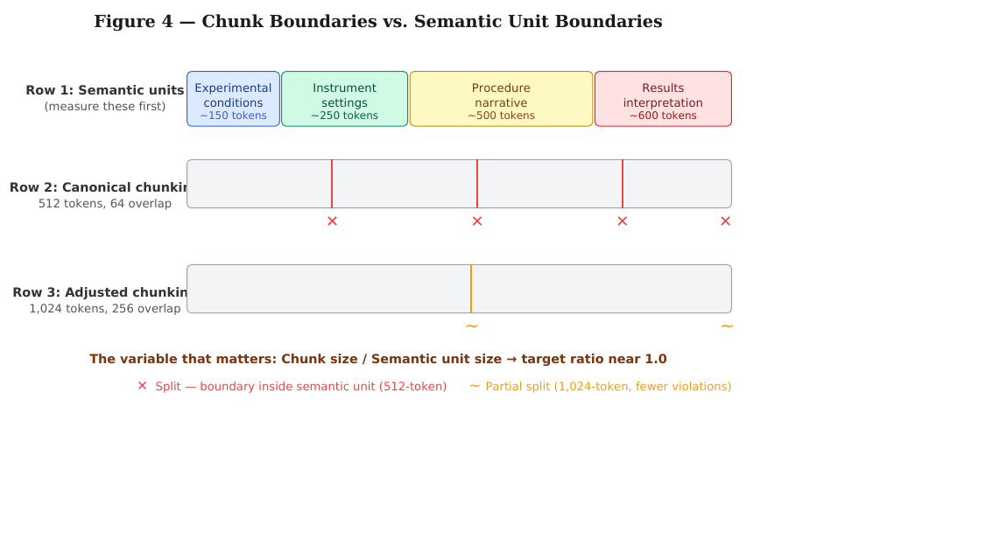
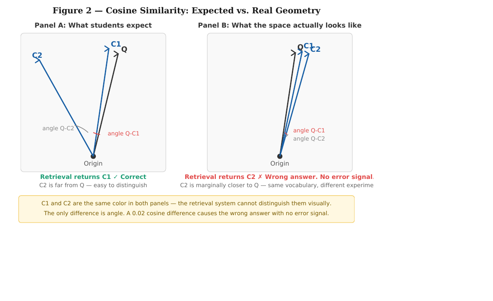
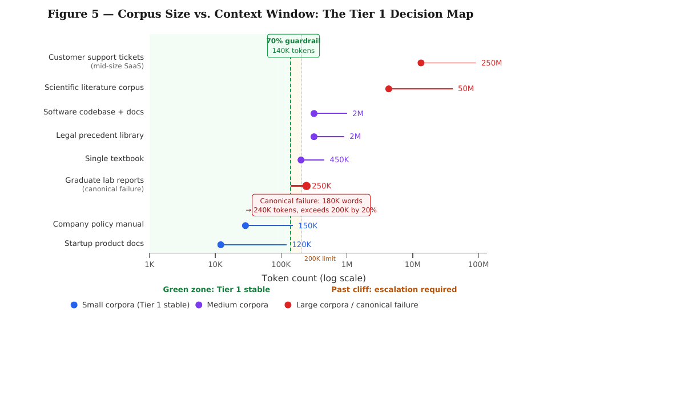
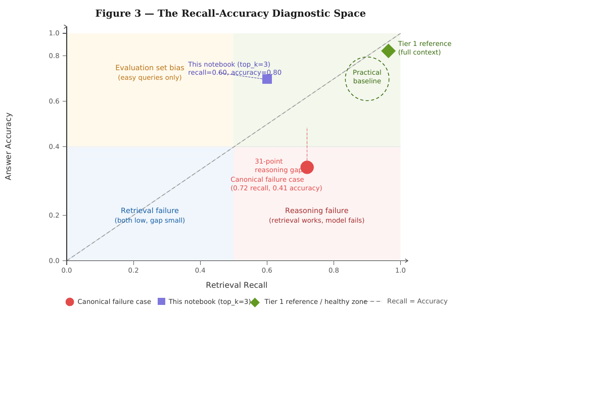
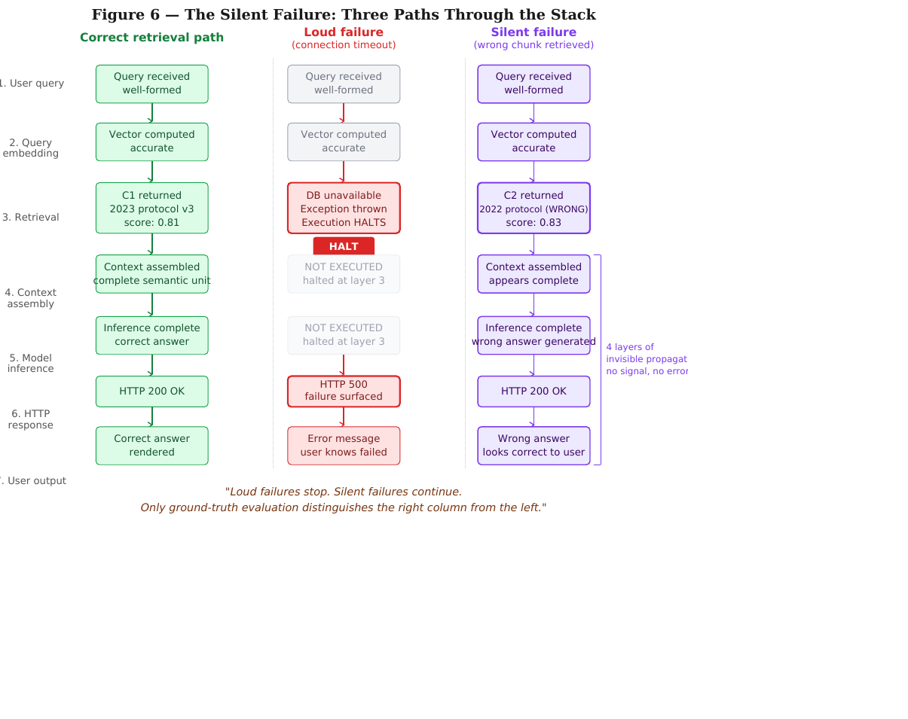

# Chapter 4 — RAG 101

*When to Build a Retrieval Pipeline and When to Skip It*

**Author:** Aditya Mitra
**Editor:** Nik Bear Brown

---

## TL;DR

RAG is a deliberate architectural bet that separating knowledge from reasoning beats keeping them fused in the model's context window. The bet pays off decisively when corpus size is large, query volume is high, updates are frequent, and queries are local — and it loses, sometimes catastrophically, outside that regime. This chapter teaches the decision as a function of four measurable variables, derives why long-context gets expensive (quadratic attention, compounded by corpus size), and walks three deployments where the decision resolves in three different directions.

---

## 4.1 The 500-Page Manual

Sit with a problem before I teach you anything.

You have a 500-page corporate policy manual. A user asks, *"What's our parental leave policy for adoptive parents in California?"* You have two reasonable ways to answer this with a large language model.

**Option A.** Feed the entire 500-page manual into the model's context window. The model reads everything, finds the relevant section, and answers. Modern models can do this — Gemini and Claude now accept a million tokens or more. One call, one answer.

**Option B.** Pre-process the manual into small chunks. Convert each chunk into a vector. Store the vectors in a database. When the user asks, convert the question into a vector, retrieve the most relevant 5–10 chunks, paste those into a much smaller context window, and ask the model to answer.

Option B is Retrieval-Augmented Generation. It's more complex, requires more infrastructure, adds a failure mode (what if retrieval misses the relevant chunk?), and is architecturally less elegant than "just feed the model everything."

And yet every serious production system I've looked at in the last three years uses some version of Option B. Why?

I've watched teams spend six months building RAG pipelines when long-context would have shipped in two weeks. I've also watched teams burn through their OpenAI budget in a week because they stuffed a million tokens into every query. Both mistakes come from not understanding the machinery. The question isn't "is RAG better than long-context?" — it's *"under what conditions does each win, and how do I tell which regime I'm in?"*

This chapter answers that question on technical, economic, and operational grounds.

### The system that couldn't find its own answer

Before the theory, a failure case that is worth understanding in full.

In the spring of 2024, a team of graduate students built what looked, on the surface, like a reasonable thing. Their research group had accumulated four years of internal lab reports — about 340 documents, totaling roughly 180,000 words — and they wanted a system that could answer questions about methodology, experimental results, and equipment settings. They built the pipeline in a weekend: chunk the documents, embed the chunks, store the vectors in a database, retrieve the top-k at query time, feed the retrieved context to the model.

The system produced confident, fluent answers. It also, on roughly one query in four, produced answers that were wrong — not hallucinated, but mislocated. It was confusing centrifuge settings from one protocol version with another because a retrieval step had pulled the wrong chunk, and the model had no way to know.

The failure was quiet. No stack traces. No runtime errors. HTTP 200 and a well-formatted string. The wrongness was invisible until someone checked the answer by hand.

The deepest irony: the entire corpus — 180,000 words — would have fit inside a single call to a contemporary large language model. The team had spent a weekend building infrastructure that made their answers worse. They never ran the token check. This chapter is the check they skipped.

---

## Learning objectives

By the end of this chapter, you should be able to:

1. **Describe** the six-stage RAG pipeline at a level sufficient to recognize it in a system diagram and identify which stage is the source of a given symptom — without configuring any stage (Chapter 27 handles configuration).
2. **Derive** why attention cost scales as $O(n^2)$ in context length, and compute the order-of-magnitude cost difference between a RAG deployment and a long-context deployment for a specified corpus size and query volume.
3. **Apply** the four-variable decision framework (corpus size, query volume, update frequency, query type) to classify a proposed deployment as pure RAG, pure long-context, or hybrid — and defend the classification against the next-most-plausible alternative.
4. **Identify** which of the four variables is the binding constraint for a given deployment, and predict how the recommended architecture changes when that variable shifts.
5. **Read the trade-off table as a constraint map** — explaining why neither RAG nor long-context wins on all axes, and why "the architecture with the best reliability" isn't a coherent question without specifying the regime.
6. **Construct** a response to the common claim that "million-token context windows make RAG obsolete," using both the quadratic-attention derivation and a specific economic calculation.

Not on this list on purpose: "understand what RAG is." That's the cheap half. The half that matters is telling the regime from four measurable numbers and refusing to build RAG when the regime says not to.

---

## Prerequisites

You need Chapter 2 (BDI vocabulary, six-layer stack). RAG is an architectural commitment at L2 (belief state) — specifically, the decision to make the belief state an external, dynamic, queryable store rather than the model's context window. The "belief freshness" question I introduced in Chapter 2 becomes concrete here: a RAG store's freshness is determined by re-indexing cadence; a long-context store's freshness is determined by how often you reload the corpus into the window.

You need Chapter 5 (memory architectures) at a general level. Chapter 5 treats memory as the problem; this chapter treats RAG as one specific solution to the problem, with its own economics and failure surface.

You don't need Chapter 27 (RAG configuration). Chapter 27 picks up from here — once you've decided *whether* to build RAG and which regime you're in, Chapter 27 covers chunking, embeddings, rerankers, and diagnostics. The chapters are a pair: Ch 4 decides, Ch 27 configures.

You need enough familiarity with transformer architecture to recognize "attention" as the operation that lets each token see every other token. If that's unfamiliar, the two-page primer in the appendix covers what this chapter needs. The quadratic-scaling derivation is self-contained.

---

## Concept 1: What RAG Commits To

Before the decision, the architecture itself. I'll keep this compressed because Chapter 27 walks through the engineering choices at each stage in depth. What you need here is enough to recognize the pipeline and understand the commitment it embodies.

**The six stages.** Raw documents get **ingested** (PDFs, Markdown, HTML, database rows — just collection, nothing intelligent yet). They get **chunked** into ~500-token segments with 50–100 tokens of overlap at boundaries. Each chunk gets **embedded** — converted into a 1,024-to-3,072-dimensional vector where semantic similarity corresponds to geometric proximity. Vectors get **stored** in a vector database ([Pinecone](https://www.pinecone.io/), [Weaviate](https://weaviate.io/), [Milvus](https://milvus.io/), [Qdrant](https://qdrant.tech/), [pgvector](https://github.com/pgvector/pgvector)) that supports approximate nearest-neighbor search via [HNSW graphs](https://arxiv.org/abs/1603.09320). At query time, **retrieval + reranking** returns the top 5–10 most relevant chunks — a fast bi-encoder stage narrowing a million chunks to 100, then a slower cross-encoder stage narrowing 100 to 10. Finally, those chunks get formatted into a prompt with the user's question, and the LLM does **generation**.

The core design philosophy in one sentence: **move the expensive work to indexing time so query time stays cheap.** Embedding 2 million chunks takes hours and costs maybe $1,000, once. Every query after that is cents. A long-context system, by contrast, pays that indexing cost on every single query — and at high query volumes the arithmetic gets ugly fast.

**What the architecture commits to.** Three things, and you should name them before you build.

First, it commits to an external belief store. The agent's knowledge of the corpus doesn't live in the model anymore. It lives in a vector database that you operate, scale, monitor, and secure. That's infrastructure you didn't have before. It's a system with its own failure modes — index corruption, stale embeddings, keyword-match gaps — that you now have to know how to diagnose.

Second, it commits to retrieval as a potential point of failure. The model can only reason over what retrieval gives it. If retrieval misses the relevant chunk, the model has no way to recover. The generation step can produce a fluent, confident answer grounded in partial or irrelevant retrieved context, and the output will look correct to anyone who doesn't already know the right answer. This is the failure mode I lose the most sleep over, and it's the one Chapter 27's diagnostic procedure is built to catch.

Third, it commits to a two-temporal-scale system. Indexing happens at one cadence (hours, days, occasionally real-time). Querying happens at another (milliseconds to seconds). The gap between them is where staleness lives. Any belief in your corpus that changed after the last re-index is wrong in your retrieval layer until the next re-index catches it. Chapter 2's belief-freshness questions apply verbatim.

**Worked example — a single query through the pipeline.** A user asks "What's our parental leave policy for adoptive parents in California?" The query gets embedded into a 1,024-dimensional vector. The vector database runs approximate nearest-neighbor search over a pre-built HNSW index of ~2,000 chunks from the policy manual, returning the top 100 by cosine similarity. A cross-encoder reranker scores each of those 100 against the full query text and keeps the top 8. Those 8 chunks — roughly 4,000 tokens total — get formatted into a prompt: *"Given the following excerpts from the company policy manual, answer the question. [chunks]. Question: [original question]"*. The model reads 4,000 tokens instead of 500,000, generates a 200-token answer, and the query returns in about 1.5 seconds.

Total input to the LLM: about 4,500 tokens. Total retrieval overhead: one vector-DB round-trip, one reranker pass. Total cost: pennies. That's the bet paying off.

### Why chunking destroys what you think it preserves

The assumption embedded in chunking: meaning is locally concentrated. A 512-token window is semantically self-contained. That assumption is often false. A methods section spans four paragraphs forming a single semantic unit. A chunk boundary between paragraphs two and three creates two incomplete fragments.

> The failure follows a fixed six-step sequence. (1) The document is divided into fixed-size chunks — a design decision made before any query is seen. (2) Each chunk is compressed into an embedding vector encoding statistical co-occurrence patterns in the embedding model's training data. (3) At query time, cosine similarity selects the chunk whose vector direction is closest to the query vector — measuring vocabulary overlap, not semantic relevance for this specific task. (4) The selected chunk is assembled into the model's context window as if it were the complete relevant passage. (5) The model generates a confident answer from incomplete information. (6) The system returns HTTP 200. The failure is complete by Step 3. Steps 4 through 6 propagate it silently. This is not a model failure — the model answered correctly from what it was given. It is an architectural failure: the design decision in Step 1 made Step 3 unreliable, and nothing in Steps 4 through 6 can detect or correct that.

```python
def chunk_corpus(corpus, chunk_words=60, overlap=15):
    # chunk_words=60 (~200 tokens) — deliberately too small.
    # Semantic unit in lab reports: ~450 tokens.
    # Ratio: 200/450 = 0.44. Target: near 1.0. Failure is structural.
    # overlap=15 words: sentence continuity only, NOT semantic continuity.
    for doc in corpus:
        words, start = doc["content"].split(), 0
        while start < len(words):
            end = min(start + chunk_words, len(words))
            yield {"doc_id": doc["id"],
                   "content": " ".join(words[start:end])}
            start += chunk_words - overlap
```

*Code 1 — Chunking function. Every design decision is a potential failure mode.*

```python
def retrieve_top_k(query, chunks, vectorizer, vectors, top_k=3):
    # THE FAILURE LIVES HERE:
    # cos(query, chunk_i) measures vocabulary co-occurrence direction,
    # NOT semantic relevance. Chunks from different protocol years
    # with identical vocabulary score nearly the same.
    scores = cosine_similarity(vectorizer.transform([query]).toarray(), vectors)[0]
    top_idx = np.argsort(scores)[::-1][:top_k]
    # No exception raised. Wrong chunk selected silently. HTTP 200.
    return [chunks[i] for i in top_idx]
```

*Code 2 — Cosine similarity retrieval. The comment marks where the wrong chunk is selected.*

The ratio principle: chunk size / semantic unit size → target near 1.0. Measure first, then chunk.



*Figure 4: Chunk Boundaries vs. Semantic Unit Boundaries. X marks where 512-token boundaries fall inside semantic units. Row 3 (1,024-token) shows fewer violations. The variable that matters: chunk size / semantic unit size → target ratio near 1.0. Measure first, then chunk.*



*Figure 2: Cosine Similarity — Expected vs. Real Geometry. Panel A: C2 far from Q (expected). Panel B: Q, C1, C2 all clustered — C2 scores 0.83 vs C1 scores 0.81. A 0.02 difference causes the wrong answer. C1 and C2 are the same color in both panels. The retrieval system cannot distinguish them.*

**Common misconception — "RAG is just semantic search with an LLM on top."** This is the marketing version. It's wrong in a specific way that matters. Semantic search returns a ranked list of documents; RAG returns an *answer conditioned on those documents*. The reasoning layer is load-bearing, and the failure modes of the two systems are different. Semantic search fails by returning the wrong documents. RAG fails by generating a confident wrong answer when retrieval returns the wrong documents. The second is worse, because the user sees an authoritative statement instead of a ranked list they can evaluate. Treating RAG as "search with better packaging" under-specifies the generation layer, and the generation layer is where most production failures manifest.

RAG has real failure modes — retrieval misses, context fragmentation, reranker mistakes, generation hallucination despite correct retrieval. Chapter 27 develops the bottom-up diagnostic for isolating each. For this chapter, what matters is that accepting RAG means accepting those failure modes in exchange for the economics you're about to derive.

---

## The Tier Selection Procedure

Before committing to any architecture, do one calculation. Estimate the word count of your corpus. Multiply by 0.75. Compare the result to the context window of the model you are using. If it fits, you may not need a RAG pipeline at all.

**Step 1 — The token check (30 seconds)**

```python
# Step 1: Token Check
token_estimate = int(word_count * 0.75)
context_window = 200_000  # your model's actual window

if token_estimate < context_window:
    print("Fits. Tier 1 recommended. Stop here.")
else:
    print("Does not fit. Escalation Trigger fires. Go to Step 2.")

# Startup docs: 63K < 100K -> Tier 1. Sprint cancelled in 60 seconds.
# Grad students: 240K > 200K -> escalate.
```

*Code 3 — The token check the graduate students never ran.*

**Step 2 — Update frequency:** Real-time updates eliminate Tier 1 and Tier 3. Tier 2 handles live data natively.

**Step 3 — Query type:** Lookup queries eliminate Tier 3. Cosine similarity is the wrong operation for deterministic lookups. SQL is correct.

**Step 4 — Latency:** Hard budget constraints can eliminate Tier 1 even when the corpus fits. A 200K-token call takes 10–30 seconds. If your budget is 500ms: hard elimination.

> **HUMAN DECISION NODE —** During the development of this chapter, the AI scaffold proposed splitting the four decision variables across two separate sections: a clean three-tier ladder followed by a complications section. I rejected this structure. A student applying the procedure to a real system cannot reconstruct a decision algorithm from a narrative split across two sections. The procedure must appear as a single sequential artifact with a named early exit (the Escalation Trigger) and a mandatory stop (the Human Decision Node). The AI proposed structure would have taught the ladder. My revised structure teaches the procedure. That distinction is the chapter's primary pedagogical claim.

### The three-tier ladder

**Tier 1: Large Context Window** — put the entire corpus in the prompt. Retrieval error rate is zero because there is no retrieval. The model synthesizes, compares, and qualifies across the entire corpus.

**Tier 2: MCP Tool Functions** — give the agent tools and let it call them at runtime. Best for live data and lookup queries with queryable schemas.

**Tier 3: Full RAG Pipeline** — chunk, embed, index, retrieve. Most powerful for large unstructured corpora. Also the most fragile.

> The three-tier ordering is not arbitrary. It follows from the asymmetry in failure modes: Tier 1 produces loud failures — context overflow triggers an API error, HTTP 413, execution stops immediately. Tier 3 produces silent failures — wrong chunk returned, HTTP 200, confident wrong answer, no error signal. Every time you choose Tier 3 for a problem Tier 1 can solve, you are not choosing a more sophisticated architecture. You are trading a detectable failure for an undetectable one. The ladder exists because the failure mode hierarchy is fixed: loud failures are always preferable to silent ones. Start at the tier with the loudest failure mode and escalate only when a hard constraint forces you to accept a quieter one.

---

## Concept 2: Why Long-Context Gets Expensive

You can't evaluate the trade-off without understanding the other side. Long-context models look like the elegant solution: one API call, no infrastructure, the model sees everything. The physics of the transformer makes them expensive in a specific, derivable way.

### The quadratic derivation

Recall from the transformer architecture: [attention](https://arxiv.org/abs/1706.03762) computes, for each token, how much it should "attend" to every other token in the context. If the context has length $n$, attention requires computing an $n \times n$ matrix of attention scores.

The computational cost is therefore $O(n^2)$ in both time and memory. **Not linear. Quadratic.**

Concretely: doubling the context from 4,000 tokens to 8,000 doesn't double the cost — it quadruples it. Going from 8,000 to 1,000,000 tokens is not a 125× increase in attention compute. It's $(10^6 / 8 \times 10^3)^2 = 125^2 = 15{,}625\times$ for a single query.

Modern long-context implementations bend this curve with optimizations — [FlashAttention](https://arxiv.org/abs/2205.14135), sliding-window attention, [ring attention](https://arxiv.org/abs/2310.01889), KV-cache reuse. But they *bend* it; they don't break it. The fundamental scaling is still bad, and the per-query cost is still dominated by the size of the context you load.

### The token economics

The cost model for a single query under each architecture:

$$C_{RAG} = (P_{sys} + P_{retrieved} + P_{query}) \cdot c_{input} + P_{output} \cdot c_{output} + c_{retrieval}$$

$$C_{LC} = (P_{sys} + P_{corpus} + P_{query}) \cdot c_{input} + P_{output} \cdot c_{output}$$

The ratio that matters is $P_{corpus} / P_{retrieved}$. For a 500,000-token corpus and 5,000 tokens of retrieved context, that's 100×. The long-context system pays 100× the input cost per query. At 50,000 queries per day, that's the difference between a $75/day bill and a $7,500/day bill on input tokens alone.

### Worked example — the legal firm comparison

Concrete setup. A legal firm has 50,000 court opinions averaging 10,000 tokens each — 500 million tokens total. The firm fields 10,000 queries per day. Current Claude Opus pricing: $15/M input tokens, $75/M output tokens [verify — pricing changes quarterly].

Obviously you can't fit 500M tokens into a 1M-token window, but pretend you could. The absurdity of the hypothetical is the point of the teaching — it makes the scaling legible in a way a "legal" example would not.

**RAG query.** 5,500 input tokens (system + retrieved + query) + 300 output = $(5{,}500 \cdot 15 + 300 \cdot 75) \times 10^{-6} = \$0.106$. Plus ~$0.003 retrieval overhead. Call it **$0.11 per query**.

**Long-context query.** 500,000,000 input tokens + 300 output = $\$7{,}500$ per query.

At 10,000 queries per day:

- RAG: $1,100/day, ~$400K/year
- Long-context: $75M/day, **~$27B/year**

The long-context version is not a business. It's a joke.

But — prompt caching. Modern providers offer cached prompts at roughly 10% of the uncached rate after the first load [verify current caching rates]. Cached long-context:

**Cached long-context query.** Still processes 500M tokens per query, but at $1.50/M input: $750 per query. $7.5M/day. $2.7B/year.

Better. Still absurd. The problem isn't the unit price. It's the architecture.

### When long-context wins

Flip the argument. Long-context is the right choice when:

1. **The relevant context is small enough to fit.** A single 150-page case file, a research paper with supporting materials, a 200K-token product-spec — no retrieval overhead, no chunking decisions, no fragmentation risk. The model sees everything.
2. **The query requires global reasoning.** *"Summarize the main argumentative arc across this 300-page document"* — no individual chunk contains the answer; the answer emerges from reading the whole thing. RAG returns a fragmented collage. Long-context returns a coherent synthesis.
3. **The data is static and reused.** Prompt caching makes long-context nearly free per marginal query when the same corpus is queried repeatedly.
4. **Accuracy matters more than cost.** For a legal memo, a medical case review, a financial due-diligence report, paying $50 for a better answer is trivially worth it. Quadratic cost doesn't matter when query volume is low.

**Common misconception — "better models and prompt caching will obsolete RAG within two years."** This is the narrative I hear most often at conferences, and it's wrong in a way that's worth spelling out.

Prompt caching reduces the cost multiplier; it doesn't change the scaling. A 10% cached rate turns a $27B/year absurdity into a $2.7B/year absurdity. A 1% cached rate would turn it into $270M/year, which is still the wrong answer for most enterprises. And caching only helps when the same corpus is queried repeatedly — if the corpus is updating hourly, cache hits collapse and you're paying uncached rates. Similarly, "better models" means better *reasoning* per token of context, not better *cost scaling*. A smarter model reading 500M tokens still processes 500M tokens. The quadratic term doesn't care how smart the model is.

The claim I'd believe is narrower: *at specific corpus sizes, under specific update patterns, long-context will continue to expand the regime where it dominates.* That's true. That's already happening. But the regime has limits, and the limits are economic, not capability-driven.



*Figure 5: Corpus Size vs. Context Window Decision Map. Real-world corpus types against the 70% guardrail (green) and 200K nominal limit (dashed). Graduate lab reports (red) exceed the window by 20%. Startup docs sit at 45% utilization. Green zone = Tier 1 stable. Warning zone (140K–200K) = fragile. Past cliff = escalation required.*

---

## Concept 3: The Four-Variable Decision Framework

You now know how both architectures work. The remaining question: for a given deployment, which do you choose?

The answer is a function of four variables. Name them, measure them, and the decision falls out.

**Variable 1 — Corpus size (C).** Total text the system needs access to, in tokens. If you don't know this number, stop and measure it. Every downstream decision hinges on it.

**Variable 2 — Query volume (Q).** Queries per day. Determines whether per-query or per-corpus cost dominates. A 1,000× difference in Q can flip the architecture choice even when C is constant.

**Variable 3 — Update frequency (U).** How often does the corpus change? Daily, weekly, monthly, never? U governs whether caching helps and how much operational complexity the freshness requirement forces.

**Variable 4 — Query type (T).** *Local* (answerable from a small subset of the corpus) or *global* (requiring synthesis across the whole corpus)? Local queries are RAG's strength; global queries are its weakness.

### The decision flow

Work through these in order. The first rule that applies determines your architecture.

1. If $C$ fits in the context window and $U$ is low, long-context is almost always right. Architecture simpler, latency acceptable, cost manageable.
2. If $C$ is much larger than the context window, you need RAG for initial retrieval. No choice.
3. If $Q$ is very high and queries are local, RAG wins on cost even when long-context is technically feasible.
4. If queries are global, you may need a hybrid — RAG retrieves a relevant *section*, long-context processes that section as a coherent unit.
5. If $U$ is high, RAG has a significant operational advantage — you're updating vectors, not reloading and re-caching million-token contexts.

The flow is not subtle. Two rules handle the extreme cases (too big for any window, or fits with stable data); three rules handle the interior (high volume, global queries, high update frequency). In interior cases, the answer is often "hybrid," which isn't a cop-out — it's the genuinely correct architecture when multiple variables bind at once.

### Worked example — three deployments, three verdicts

To exercise the framework, walk through three deployments that resolve in three different directions. These are composite profiles, chosen to cover the range of the (C, Q, U, T) space; a real deployment of any of them would have slightly different numbers but the verdicts would hold.

**Deployment A — SaaS customer support bot.**
- $C$ = 2M tokens (10,000 help articles)
- $Q$ = 50,000 queries/day
- $U$ = daily (docs change constantly)
- $T$ = local (most queries answerable from 1–3 articles)

Walk through the flow. Rule 1 fails (2M doesn't fit in most windows; even where it does, daily U kills caching). Rule 2 applies (RAG for retrieval). Rule 3 confirms (high Q + local queries is RAG's sweet spot). Rule 5 reinforces (daily updates favor RAG's incremental-indexing model).

**Verdict: Pure RAG.** This is the deployment RAG was designed for. Every variable points the same direction.

**Deployment B — Legal memo drafting from a single 150-page case file.**
- $C$ = 200K tokens (fits in modern long-context)
- $Q$ = 20 queries/day (associates on the case)
- $U$ = weekly (new filings occasionally)
- $T$ = global (queries require reasoning across the whole case)

Walk through. Rule 1 applies (fits, U is low). Rule 4 reinforces (global queries are long-context's strength). Low Q means per-query cost is bearable; weekly U means prompt caching pays for itself across many queries.

**Verdict: Long-context, with prompt caching.** This is where long-context shines, and where teams that default to RAG waste months of engineering time. The associates don't need a vector database. They need the model to see the whole case.

**Deployment C — Enterprise knowledge assistant, 500M tokens of internal documents, queries spanning multiple departments.**
- $C$ = 500M tokens (far beyond any context window)
- $Q$ = 5,000 queries/day
- $U$ = hourly (active knowledge base)
- $T$ = mixed (some local, some requiring synthesis)

Walk through. Rule 2 applies (500M exceeds any window, so RAG is forced at some level). Rule 4 also applies (global queries need long-context at some level). Both rules apply to different parts of the same deployment.

**Verdict: Hybrid.** RAG retrieves a relevant cluster of chunks — maybe 50 chunks totaling 25,000 tokens — and long-context processes that cluster as a coherent window for synthesis. This is the architecture I expect to dominate enterprise deployments over the next two years, and it's where most of the interesting engineering work is happening now.

### Failure modes across all three tiers

One question routes every failure: *Was the information needed to answer correctly present in what the system actually saw?*

- **Yes** → reasoning failure. The chunk arrived; the model failed to use it correctly.
- **No** → retrieval failure. The relevant passage never reached the model.

| Tier | Failure name | Trigger condition | Detection signal | Diagnosis approach |
|------|-------------|-------------------|-----------------|-------------------|
| Tier 1 — Long-Context | Context Dilution | Corpus too large; relevant content buried among irrelevant tokens | Synthesis queries degrade while lookup queries hold steady | Isolate corpus subset; re-run failing queries on reduced context to confirm dilution |
| Tier 2 — MCP Tools | Semantic Drift | Tool query uses keywords that miss indirect or paraphrased expressions of the target concept | Syntactically valid tool call returns empty or irrelevant results; no error raised | Audit tool query terms against actual document vocabulary; broaden or rephrase query keywords |
| Tier 3 — Full RAG | Wrong Chunk | Two chunks share similar vocabulary but belong to different versions or contexts; cosine similarity cannot distinguish them | HTTP 200 with confident but factually incorrect answer; error only visible on manual review | Build eval set first; measure recall vs. accuracy gap; both low = retrieval failure; recall low + accuracy high = evaluation set bias |

**Tier 1 — Context Dilution:** asymmetric degradation — synthesis queries fail while lookup queries hold. Isolate the corpus before changing tiers.

**Tier 2 — Semantic Drift:** syntactically valid tool call, subtly wrong question. In the 2024 legal discovery case, "discussed settlement authority" as keywords missed all deliberative communications using indirect language. Undetected three weeks.

**Tier 3 — Wrong Chunk.** Build the evaluation before the pipeline:

```python
# Build evaluation BEFORE the pipeline.
EVAL = [
    {"query": "Current centrifuge speed?",
     "relevant": "GM-2023-007", "keywords": ["6,200", "current"]},
    {"query": "Which versions used PBS buffer?",
     "relevant": "GM-2022-003", "keywords": ["3,200", "4,500", "pbs"]},
    # 3 more: synthesis, lookup, contradiction
]

recall   = hits_where_relevant_in_top_k / total
accuracy = hits_where_keywords_in_context / total

# recall >> accuracy  -> reasoning failure (chunks incomplete)
# both low, small gap -> retrieval failure (wrong chunks)
# accuracy > recall   -> evaluation set bias (easy queries only)
```

*Code 4 — Evaluation pattern. This notebook: recall=0.60, accuracy=0.80 = evaluation set bias.*



*Figure 3: Recall-Accuracy Diagnostic Space. Canonical failure (red) at 0.72/0.41 — 31-point reasoning gap. This notebook (purple) at 0.60/0.80 — evaluation set bias zone.*

### The failure that looks like success

A model given a wrong chunk produces a confident wrong answer with the same surface characteristics as a correct answer. Unlike a programming error, a retrieval error does not crash. It returns HTTP 200 and a string.

```python
# LOUD failure: db.query() -> ConnectionError -> HTTP 500 -> developer fixes it

# SILENT failure (RAG):
# retrieve_top_k() -> [wrong_chunk]           # no exception
# model.generate(wrong_chunk) -> wrong_answer # no exception
# response.status_code -> 200                 # looks successful
# detection: None until human reviewer checks source document

# Only difference between correct and wrong run:
# Correct: chunk["doc_id"] == "GM-2023-007"  score: 0.81
# Wrong:   chunk["doc_id"] == "GM-2022-003"  score: 0.83
# A 0.02 cosine difference. Invisible above Layer 3.
```

*Code 5 — Silent failure anatomy. The 0.02 score difference is the entire causal chain.*



*Figure 6: Three Paths Through the Stack. Correct (left), loud failure — HALT at Layer 3, HTTP 500 (center), silent failure — all 7 layers, HTTP 200, wrong answer (right). Loud failures stop. Silent failures continue. Only ground-truth evaluation distinguishes the right column from the left.*

### The AI scaffold and the human decision node

The AI Scaffold proposes tier candidates, flags its own assumptions, then halts. It cannot finalize the architecture — it does not know your query distribution, corpus semantic structure, or tolerance for silent failure. You do.

```python
# AI SCAFFOLD — proposes candidates, flags assumptions, HALTS.
tokens = int(word_count * 0.75)

if tokens < 200_000:
    print(f"[VIABLE] Tier 1 — {tokens:,} tokens fits 200K window")
    print("  AI ASSUMPTION: model has 200K window — VERIFY THIS")

print("=" * 50)
print("SCAFFOLD HALTED — HUMAN DECISION NODE REQUIRED")
print("Complete the Tier Selection Brief before proceeding.")
# The scaffold does not finalize. You do.
```

*Code 6 — Mandatory HALT. The scaffold enumerates candidates and flags its own assumptions.*

### The honest trade-off table

Read this as a **constraint map, not a leaderboard**. The pattern with the lowest latency is not the best pattern — it is the best pattern for tasks where latency is the binding constraint. Reliability scores below are conditional on correctly tuning the load-bearing parameter at each stage (Chapter 27 owns that tuning).

| Dimension | RAG | Long-Context |
|---|---|---|
| Cost at scale | Low; flat per query | High; linear in corpus size |
| Latency | 1–2 seconds typical | 10–60+ seconds at 1M tokens |
| Data freshness | Near-instant updates | Must reload/recache for updates |
| Global reasoning | Weak — chunks fragment context | Strong — sees everything |
| Citation accuracy | High — chunks map to sources | Variable — attention can blur |
| Operational complexity | High — pipeline, vector DB, reranker | Low — just call the API |
| Failure modes | Retrieval miss, fragmentation | Cost, latency, attention dilution |

What the trade-off really is: **RAG moves complexity out of the model and into your infrastructure. Long-context keeps the infrastructure simple and pushes the cost onto every query.** Neither is free. The choice is about which cost you'd rather pay.

**Common misconception — "RAG is the default."** It isn't. It's the right default for high-volume, large-corpus, local-query deployments — which happens to be many commercial AI products, which is why the default became folk wisdom. Outside that regime, defaulting to RAG wastes months of engineering time and loses answer quality. For a team with a 200K-token product-spec and twenty internal users, the right first build is a long-context API call. Ship that, measure, and add RAG only if the numbers say to.

---

## Integration: The Design Philosophy of the Field

Step back. Why did the field converge on this architecture instead of some alternative?

The deep answer is that the field optimized for a specific trade-off: **separate the knowledge from the reasoning.** RAG treats the LLM as a reasoning engine that queries an external, dynamic knowledge base. It parallels how human cognition works — we don't memorize every fact; we know how to look things up and then reason about what we find.

The alternative — bake all knowledge into the model's weights — was tried. It's called "fine-tuning on your documents," and it mostly doesn't work for knowledge retrieval. The model learns the *style* of your documents but not reliable access to their *facts*. It hallucinates. The field learned, expensively, that **pretrained weights are for reasoning and external stores are for facts.**

This is what I mean when I say the design philosophy reveals what the field values. RAG embodies the bet that reasoning and knowledge should be decoupled. Long-context embodies the opposite bet — that if you just make the context big enough, the distinction stops mattering. The current state of the art suggests the first bet was mostly right, with the second reserved for specific use cases.

The choice of where to put memory is the choice of what kind of system you're building. In agents that operate over days, weeks, and months (Chapter 5), the memory layer becomes something richer — hierarchical stores, episodic memory, feedback memory, pattern memory. The six-stage pipeline described here becomes the foundation, not the whole building.

The model is increasingly a commodity. **The memory is the product.** Everything interesting that happens next in AI happens in this layer.

Before you reach for RAG, measure your four variables. Before you reach for long-context, do the cost calculation. The architecture is not a default. It is a bet, and the bet has a regime.

---

## Chapter Summary

Four capabilities you can now exercise.

You can describe the six-stage RAG pipeline at the level where Chapter 27 picks up to configure each stage. You know what the architecture commits to (an external belief store, retrieval as a failure point, a two-temporal-scale system) and you can name the failure modes without having yet learned to debug them.

You can derive why attention cost scales as $O(n^2)$ and compute, to an order of magnitude, what a given deployment costs under RAG vs. long-context. The legal firm comparison — $0.11/query vs $7,500/query, $400K/year vs $27B/year — is the cost model made honest, and the math survives any reasonable variation in the pricing inputs.

You can apply the four-variable decision framework (corpus size, query volume, update frequency, query type), walk through the five-rule decision flow, and identify hybrid cases where both RAG and long-context are binding. You can look at a proposed deployment and recommend pure RAG, pure long-context, or hybrid, defending the choice against the next-simplest alternative.

You can read the trade-off table as a constraint map rather than a leaderboard, and you know that no architecture wins on all axes. The highest-reliability row in the table, stripped of its regime, is a meaningless claim.

**The one idea that matters most: RAG is the architectural expression of a design philosophy — separate reasoning from knowledge, move expensive work to indexing time, keep query time cheap.** Everything else follows from that choice.

**The common mistake to watch for:** treating RAG as a default without first measuring the four variables. It's the right default for high-volume, large-corpus, local-query deployments. Outside that regime — small corpora, low query volume, global reasoning, high-stakes one-shot analysis — long-context or hybrid wins, and defaulting to RAG wastes months of engineering time and loses answer quality.

**The Feynman test, applied here:** could you teach someone, in fifteen minutes, why a million-token context window doesn't make RAG obsolete? If yes, you've got it. If not, the economic comparison is the place to go back to.

---

## Connections Forward

**Chapter 27** picks up from this chapter. Once you've decided *whether* to build RAG and which regime you're in, Chapter 27 covers *how* — chunking strategies (fixed-size vs. semantic, chunk size, overlap mechanics), embedding-model selection (the four decision dimensions), the bi-encoder/cross-encoder two-stage pattern, and a bottom-up diagnostic procedure for isolating failures across the pipeline. The chapters are a pair: Ch 4 decides, Ch 27 configures.

**Chapter 5** (agentic memory) sits alongside this chapter rather than after it. Ch 5 treats memory as the general problem; Ch 4 treats RAG as one specific solution with specific economics. The close of this chapter — "the memory is the product" — is what Ch 5 develops: how a vector database is the foundation but not the whole building, once the agent operates over days, weeks, and months.

**Chapter 15** (evaluation metrology) is where retrieval-quality metrics live — precision@k, recall@k, NDCG, MRR. Ch 4 tells you which architecture to build; Ch 15 tells you how to tell if it's working. The two chapters need each other: without evaluation, you can't distinguish a RAG that's working from one that's failing silently on 30% of queries.

**Chapter 18** (security and attack surface) revisits RAG as a target. Vector stores can be poisoned — see OWASP ASI06 on memory and context manipulation [verify current spec numbering]. The same write path that makes RAG operationally simple makes it a target for adversarial inputs. Ch 18 covers the attack surface and the defenses.

One thread that runs forward from here: the design philosophy of "separate reasoning from knowledge" isn't settled. Long-context is eating into RAG's regime at the margins every quarter. Hybrid architectures are where most of the interesting engineering work is happening now. I expect Ch 5 and Ch 27 will both be partially out of date within a year of this chapter shipping. The framework — four variables, measured honestly — should survive the architectural churn. The specific defaults won't.

---

## Exercises

Each exercise names the learning objective it tests and indicates rough difficulty. Solutions are in the appendix; attempt each problem before comparing notes.

### Warm-up (direct application of one concept)

**Exercise 4.1** *[Tests: pipeline stage recognition]* Distinguish retrieval from reranking in the RAG pipeline. In one paragraph, explain why a production system uses both stages rather than one, and what specific failure mode each stage prevents. Then name the single parameter in each stage whose mis-setting is most likely to cause that failure mode. **Difficulty: 1/5.**

**Exercise 4.2** *[Tests: chunk-count arithmetic]* You have 1 million documents averaging 5,000 tokens each. You chunk them at 500 tokens per chunk with 100 tokens of overlap between consecutive chunks. How many total chunks does the vector database hold? Show your work. Then compute the same number for 250-token chunks with 50-token overlap, and comment on what the change does to retrieval recall and per-query cost. **Difficulty: 1/5.**

**Exercise 4.3** *[Tests: RAG per-query cost calculation]* Given current Claude Opus pricing ($15/M input, $75/M output [verify]), compute the per-query RAG cost for this setup: system prompt 500 tokens, 6,000 tokens of retrieved context, 100-token query, 400-token output. Then compute the daily cost at 50,000 queries/day and the annual cost. Finally, identify which of the four inputs to the formula has the largest effect on total cost, and what that implies for where to invest engineering effort if cost reduction is the goal. **Difficulty: 2/5.**

### Application (translation to a different problem)

**Exercise 4.4** *[Tests: quadratic attention + real-world deviation from pure $O(n^2)$]* Using the $O(n^2)$ scaling, compute the theoretical cost ratio for a single query between a 32K-token context and a 256K-token context. Then explain, in three to five sentences, why modern long-context implementations deviate from the pure $n^2$ curve — specifically what FlashAttention, KV-cache reuse, and sliding-window attention each contribute. End by describing one operational regime where the deviation from pure $n^2$ is significant enough to change an architecture recommendation. **Difficulty: 3/5.**

**Exercise 4.5** *[Tests: four-variable framework applied to a new deployment]* You're advising a team building a medical literature assistant: 30M tokens of peer-reviewed papers, updated weekly with new publications, 500 queries/day from a team of researchers, queries almost always requiring synthesis across multiple papers. Apply the four-variable framework. Identify which variable is the binding constraint. Recommend an architecture and defend the choice against the next-most-plausible alternative. Specify where prompt caching would or would not help, and why. **Difficulty: 3/5.**

**Exercise 4.6** *[Tests: critique a specific RAG configuration]* A team ships a RAG pipeline with these choices: 1,000-token chunks with no overlap, a single bi-encoder retrieval stage (no reranker), top-5 chunks passed to generation. Post-launch, the system hallucinates on 30% of queries. Using only the vocabulary in this chapter, identify at least three distinct failure modes this configuration enables, and for each, propose the specific architectural change that fixes it. **Difficulty: 3/5.**

### Synthesis (combining concepts)

**Exercise 4.7** *[Tests: RAG-vs-long-context crossover analysis]* For a 100M-token corpus, plot daily cost as a function of query volume (from 100/day to 100,000/day) under three architectures: (a) RAG, (b) uncached long-context, (c) long-context with prompt caching at 10% of uncached. Identify the crossover points where each architecture becomes cheapest. Then describe how the crossover shifts if the cache rate drops to 2% of uncached, and what that shift implies for enterprises evaluating long-context as RAG's successor. A rough spreadsheet and labeled plot is sufficient. **Difficulty: 4/5.**

**Exercise 4.8** *[Tests: defending the master argument]* Critique the following claim in a 500-word response: *"Within two years, long-context models with aggressive prompt caching will obsolete RAG for all but the largest corpora."* Your response should include at least one specific cost calculation supporting or refuting the claim, identify the specific empirical conditions under which the claim would become true, and name at least one technical reason the claim is unlikely to become true on that timeframe. **Difficulty: 4/5.**

### Challenge (open-ended, beyond the chapter's boundary)

**Exercise 4.9** *[Tests: hybrid architecture design]* Design a hybrid RAG + long-context architecture for a law firm with 1,000 active cases, each consisting of 100K–500K tokens of documents. Associates ask queries that sometimes require single-case synthesis (global within one case) and sometimes require cross-case research (local within a doctrine, across cases). Specify: what goes in the vector database, what goes in long-context, how retrieval routes between them, and what the latency and cost budget looks like per query type. Identify at least two failure modes your architecture introduces that neither pure RAG nor pure long-context would produce. **Difficulty: 5/5.**

**Exercise 4.10** *[Tests: memory poisoning threat model]* Using the hybrid architecture from Exercise 4.9, construct a threat model for memory poisoning along the lines of OWASP ASI06 [verify current spec numbering]. Identify where in the architecture the attack surface lives (ingestion? embedding? retrieval? generation?), what specific defenses apply at each stage, and what each defense costs in latency, accuracy, or operational complexity. Include at least one defense that is common in production and at least one that is theoretically sound but rare. **Difficulty: 5/5.**

**Exercise 4.11** *[Tests: RAG as agentic long-term memory]* The close of this chapter argues "the memory is the product." Sketch an architecture for an agentic system that uses a RAG-like store not as a corpus-lookup tool, but as the agent's long-term memory across sessions — storing past decisions, outcomes, user preferences, and learned patterns. Specifically address: what's different about ingestion when "documents" are the agent's own decisions + outcomes rather than external text; how freshness and contradiction-resolution work in this regime (building on Chapter 2's four belief questions); and what the write-gate policy should be to prevent the agent from poisoning its own memory. **Difficulty: 5/5.**

---

**What would change my mind:** prompt caching rates falling below roughly 1% of uncached, combined with verified-uniform attention across million-token windows (no lost-in-the-middle). That combination would make long-context the default for corpora up to ~5M tokens — a range that covers most enterprise deployments. The first is plausible on a two-year horizon; the second isn't, on any horizon I can see. If both land, Ch 4 needs a substantial revision, and I want to know.

**Still puzzling:** I don't fully understand how hybrid architectures should decide *what to retrieve and then long-context-process.* The current answer is heuristic — grab 20–50 chunks covering the relevant subtopic, dump them into a window, let the model synthesize. That works, but it leaves on the table a sharper question: under what conditions would you dynamically re-retrieve during synthesis rather than pre-retrieve and freeze the window? I haven't seen a clean framework for that decision, and I think there's a chapter in it. Exercise 4.9 is where I ask you to start pulling at the thread.

---

## References

- Lewis, P., Perez, E., Piktus, A., et al. (2020). [Retrieval-Augmented Generation for Knowledge-Intensive NLP Tasks](https://arxiv.org/abs/2005.11401). NeurIPS 2020.
- Vaswani, A., Shazeer, N., Parmar, N., et al. (2017). [Attention Is All You Need](https://arxiv.org/abs/1706.03762). NeurIPS 2017.
- Dao, T., Fu, D., Ermon, S., Rudra, A., & Ré, C. (2022). [FlashAttention: Fast and Memory-Efficient Exact Attention with IO-Awareness](https://arxiv.org/abs/2205.14135). NeurIPS 2022.
- Liu, H., Zaharia, M., & Abbeel, P. (2023). [Ring Attention with Blockwise Transformers for Near-Infinite Context](https://arxiv.org/abs/2310.01889). arXiv:2310.01889.
- Malkov, Y. A., & Yashunin, D. A. (2016). [Efficient and robust approximate nearest neighbor search using Hierarchical Navigable Small World graphs](https://arxiv.org/abs/1603.09320). arXiv:1603.09320.
- Liu, N. F., Lin, K., Hewitt, J., et al. (2023). [Lost in the Middle: How Language Models Use Long Contexts](https://arxiv.org/abs/2307.03172). arXiv:2307.03172.
- Anthropic. [Prompt caching documentation](https://docs.anthropic.com/en/docs/build-with-claude/prompt-caching). Anthropic developer docs [verify current caching rates].
- Vector databases referenced: [Pinecone](https://www.pinecone.io/), [Weaviate](https://weaviate.io/), [Milvus](https://milvus.io/), [Qdrant](https://qdrant.tech/), [pgvector](https://github.com/pgvector/pgvector).
