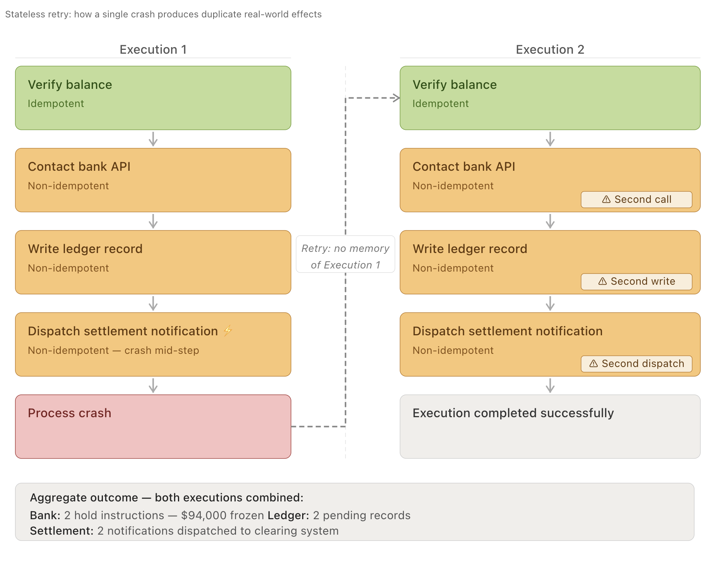
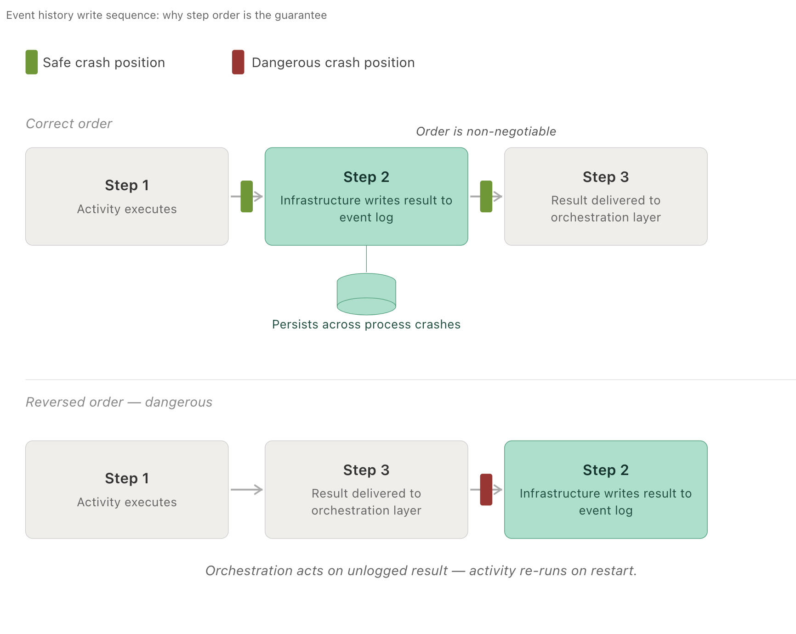
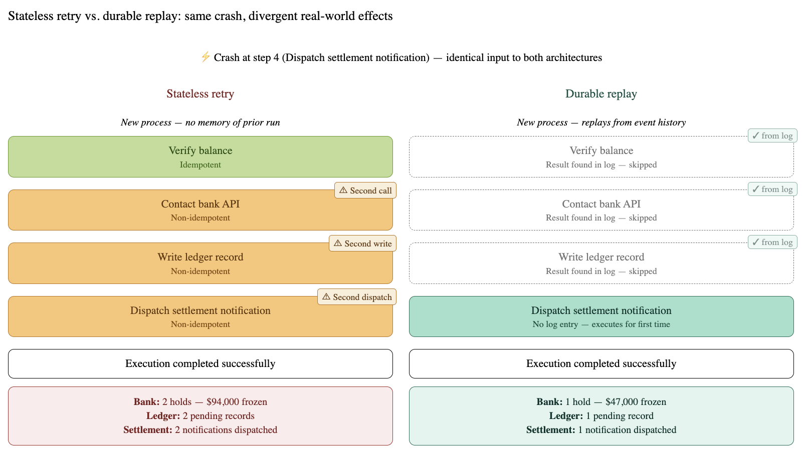
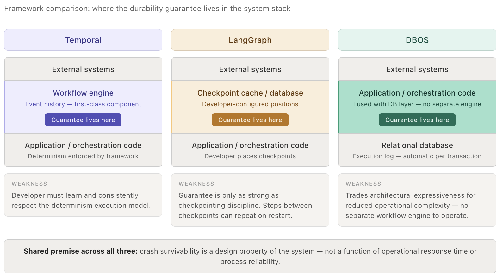
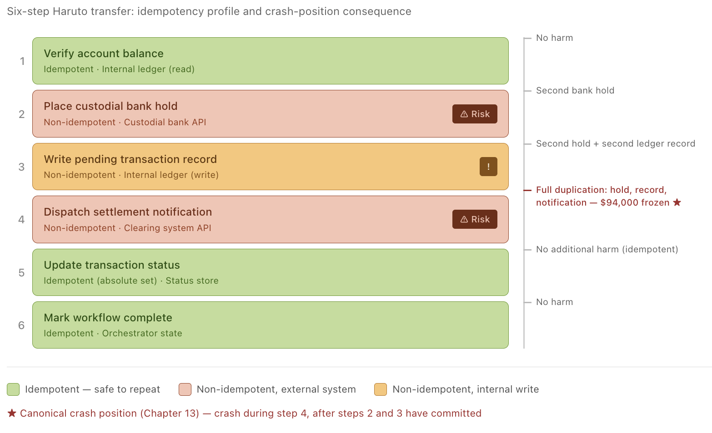

# Chapter 13: Durable Execution in Agentic Systems

**Author:** Pavan Garlapati

---

On the morning of March 14th, a customer named Haruto Nakamura attempted to transfer $47,000 from his brokerage account into a newly opened retirement fund. He submitted the request at 9:04 a.m., watched a spinner animate for several seconds, and received an error message that told him nothing — only that something had gone wrong and he should try again. He tried again. The spinner returned. Another error. He called his broker.

What Haruto did not know, and what the broker's support team would spend the next six hours untangling, was that his original request had not failed. It had succeeded — partially. An automated agent running inside the brokerage's infrastructure had received his transfer instruction and begun executing a sequence of operations: it contacted the custodial bank's API, which placed a hold on $47,000 in his brokerage account; it wrote a pending transaction record to the firm's internal ledger; and then, somewhere in the middle of dispatching a notification to the downstream settlement system, the server process died. A routine memory limit, hit at the worst possible moment.

The platform's retry logic did what it was designed to do. It looked at the request, saw no record of a completed transfer, and started over. The agent contacted the custodial bank's API a second time. The bank, which had no reason to suspect anything unusual, placed a second hold on $47,000. Haruto now had $94,000 frozen — nearly his entire liquid position — against a single $47,000 transfer. He could not cover a margin call that came in at 11:30 a.m. By the time the operations team identified the duplicate hold and contacted the bank to release it, the call had already triggered a forced liquidation of a position he had held for three years.

The error was not in the transfer logic. The transfer logic was correct. The error was in a silent assumption embedded in the system's architecture: that any operation which had not been confirmed complete could safely be run again from the beginning. This assumption is so natural that most engineers do not recognize it as an assumption at all. *Of course* you retry failed operations. *Of course* you start from the beginning if you don't know where you stopped. What else would you do?

The answer to that question is the subject of this chapter.

---

What happened to Haruto's account is an instance of a problem with a precise structure. The agent's work consisted of multiple steps, and those steps reached into the world — they changed state in systems outside the agent's own memory. Once the first step completed, the world was different. The bank had been told something. A record had been written. These were not tentative acts; they were commitments, and they could not be uncommitted by crashing. When the agent restarted and repeated those steps, it was not recovering from failure. It was performing new actions on a world that had already received the first set. The retry was not a do-over. It was an addition.



The deeper problem is that the agent had no way of knowing this. It had no memory of what it had already done. Its sense of its own progress existed only in the volatile memory of a process that no longer existed. From the agent's perspective, it had never started. From the bank's perspective, it had started twice.

It would be natural to read what happened to Haruto as bad luck — a crash at the worst possible moment, a rare confluence of timing and fragility that could just as easily have missed. That reading is wrong. The crash did not cause the failure. The crash was the condition that made a pre-existing failure visible. The decision that caused the failure was made long before any process died: the decision to keep the agent's memory of its own progress inside the running process. Given that decision, and given any crash after the first irreversible step, the outcome was not possible — it was guaranteed. A different crash, on a different day, against a different account, would produce the same sequence of events through the same mechanism for the same reason. The architecture does not fail occasionally. It fails reliably, whenever the conditions it cannot survive finally arrive. What happened to Haruto was not an accident the system suffered. It was a result the system was built to produce.

A system that survives its own crashes without repeating the work it already sent into the world is called **durable**. This gap — between what an agent believes about its own history and what the world actually received — is the fault line along which durable execution is built.

---

Look closely at the sequence of steps the agent performed, and a distinction emerges that is easy to miss because both kinds of steps look identical in code. Some of what the agent did was purely internal: it evaluated conditions, chose a path, decided what to do next. If those steps were repeated, nothing changed — the same conditions produced the same decisions, and the world outside the agent was untouched. But other steps were different in kind, not just in degree. When the agent contacted the bank, something happened at the bank. When it wrote to the ledger, a record existed that had not existed before. When it dispatched a notification, a downstream system received a signal and began acting on it. These steps did not compute a result — they caused an effect, and that effect persisted whether or not the agent survived to remember causing it. Repeating the first kind of step was safe because repetition produced nothing new. Repeating the second kind was catastrophic precisely because it did.

---

## Section 2: The Architecture of Memory

The gap described at the end of the previous section is not a gap that better hardware closes, or that faster networks make less likely, or that careful operations teams can monitor their way around. It is a design defect — a structural property of systems that treat an agent's memory of its own work as something that lives only inside the running process. Every system built this way will eventually fail in exactly this manner, because every running process eventually stops. The question is not whether the process will die mid-execution. The question is what the system is built to do when it does.

Answering that question requires understanding why the Haruto scenario failed at the level of architecture, not at the level of incident response. The agent that processed his transfer was designed to perform a sequence of steps and to hold its progress in working memory — in the live state of the running process. That is a reasonable design for a calculation that takes milliseconds and touches nothing outside itself. It is an unreasonable design for a sequence of operations that may take seconds or minutes, that calls external systems, and that causes effects that cannot be undone by simply stopping. The design choice to keep all state in process memory is not neutral. It is a bet: a bet that the process will survive long enough to finish. Haruto's account was the cost of losing that bet.

The architecture of durable execution begins by refusing to make that bet. It does so through a separation that maps directly onto the distinction the last section introduced: between steps that only advance internal logic, and steps that reach out and change the world.

### Separating Decisions from Actions

Consider how the Haruto transfer agent actually worked. At the level of code, it was a program that made decisions: if the account balance is sufficient, contact the bank; if the bank confirms the hold, write to the ledger; if the ledger write succeeds, notify the settlement system. This decision-making structure — the branching, the sequencing, the conditional logic — is entirely deterministic. Given the same starting conditions and the same results from external systems, the program will always make the same decisions in the same order. There is no randomness in the logic itself. The logic is a map. What changes with each execution is the territory the map is applied to: the account balance, the bank's response, the ledger's confirmation.

Because the orchestration logic always makes the same decision given the same inputs, it can be replayed from the beginning without re-running any real-world steps — as long as those steps' results have been saved somewhere the process cannot take with it when it dies. Durable execution architectures exploit this property by separating the map from the territory and treating them differently. The decision-making logic — the part that branches and sequences and evaluates — is called the **orchestration layer**. It is required to be strictly deterministic: no random numbers, no reading the current time, no side effects of any kind.

In most durable execution frameworks, this is a convention enforced by code review and testing rather than a runtime check. A loud failure — a runtime exception, a type error, a rejected API call — is detectable. A silent correctness failure is not: the replay quietly follows a different decision path than the original execution, invoking different activities or applying different logic, with no alarm raised and no error produced. This is called a **silent correctness failure**, and it is the most dangerous violation of the determinism constraint because nothing in the system signals that anything has gone wrong.

The orchestration layer is pure logic. The steps that actually touch the world — contacting the bank, writing the ledger record, dispatching the notification — are isolated into discrete, self-contained units. Call them **activities**. The orchestration layer does not perform these actions itself. It declares that they should happen, hands them off, and waits for a result.

This separation is not cosmetic. It is the structural precondition for everything that follows. Because the orchestration logic is deterministic, any system that can supply it with the same sequence of external results will produce the same sequence of decisions. This means the orchestration logic can be re-run — not to redo the work, but to reconstruct the state of a program that was interrupted. The key is in how those external results are stored.

### The Event History

When the Haruto transfer agent handed off its first activity — contact the custodial bank, place a hold on $47,000 — something needed to happen that did not happen in the original system: the result of that activity needed to be written down somewhere that was not inside the running process. Not cached. Not buffered. Written, durably, to storage that would survive the process dying.

This is the **event history**. It is a sequential log — a record of every external result the agent has received, in the order it received them. When the bank responded to the hold request with a confirmation, that confirmation was written to the log before the orchestration layer was allowed to proceed. When the ledger write completed, that completion was written to the log. Each entry is timestamped, ordered, and written as an append — existing entries are never modified or deleted, because a log that could be rewritten could not be trusted as a record of what actually reached the world. The log does not record what the agent intended to do. It records what the world confirmed back.

The event history is written by the execution system that manages the agent, not by the agent's own code. This is deliberate. The agent's code cannot be trusted to write its own history reliably, because the agent's code is exactly what crashes. In practice, activities are not called directly by the orchestration code — they are submitted to the execution system as work items, and the execution system calls them, receives their return values, writes the results to the event history, and only then delivers those results back to the orchestration layer. The agent's code never touches the log; it only sees results that the execution system has already recorded.

The infrastructure writes the record before the result is handed back to the orchestration layer. The sequence is: activity completes, infrastructure writes the result to the log, result is delivered to the orchestration layer. If the process dies between the first and second of those steps, the log is intact and the result will be delivered again when a new process starts. If the process dies between the second and third, the same thing happens. **The log is always ahead of the agent's knowledge, never behind it.**

```python
# activity: a discrete operation that reaches outside the agent and causes a real-world effect.
function execute_activity(activity, orchestration_layer):
    prior = event_history.get(activity.id)
    if prior is not None:
        orchestration_layer.receive(prior)   # same delivery path as live execution
        return
    result = activity.run()                  # Step 1: activity executes
    event_history.write(activity.id, result) # Step 2: infrastructure writes to log
    orchestration_layer.receive(result)      # Step 3: deliver to orchestration layer
```

The write in step 2 must precede step 3 because if the process dies between them, the result exists in the log and will be replayed correctly on restart — but if the order is reversed and the process dies after step 3 but before step 2, the orchestration layer has already acted on a result that the log does not contain, and the next execution will re-run the activity against a world that has already received it.



### Replay

Now suppose the Haruto transfer agent crashes at the moment described at the beginning of this chapter: the bank hold is confirmed, the ledger record is written, and the process dies while dispatching the settlement notification. A new process starts. It picks up the Haruto transfer request. What does it do?

In the original system, it started over. It had no memory of what had already happened, so it treated the request as new. That was the defect.

In a durable execution system, the new process does not start over. It starts a **replay**. The orchestration layer begins executing the decision logic from the beginning — but this time, every time it reaches a point where it would normally hand off an activity and wait for a result, it checks the event history first. It asks: has this activity already been completed? Is its result already in the log?

For the bank hold activity, the answer is yes. The log contains the bank's confirmation. The orchestration layer takes that recorded confirmation, treats it as the result of the activity, and advances — without contacting the bank again. For the ledger write, the same thing happens. The recorded result is supplied directly. The orchestration layer reaches the point where it would dispatch the settlement notification and checks the log again. This time, there is no record. The activity was in progress when the process died, and no result was ever written. The orchestration layer hands off the activity for real, and the notification is sent — once, for the first time, from the world's perspective.

The replay did not repeat the work. It reconstructed the agent's state by walking the same decision path with the same recorded results, and it resumed from exactly the point where the log ran out. The bank was contacted once. The ledger was written once. Haruto's $47,000 was held once.



This reconstruction works because of the determinism enforced on the orchestration layer. A deterministic program supplied with the same sequence of inputs will always reach the same state. The event history is that sequence of inputs, preserved across the death of any number of processes. The orchestration layer is the function that maps those inputs to state — and if that function is not strictly deterministic, the guarantee collapses: a replay supplied with the same log entries may follow a different decision path than the original execution, reaching a different state, invoking different activities, and producing effects on the world that the original process never intended. Together, they make the agent's progress a property of the log — something that persists in durable storage — rather than a property of a running process, which does not.

What this architecture enforces is **correctness** — and that word deserves to be used precisely, because it means something stronger than reliability. A reliable system is one that fails rarely. A correct system is one that, regardless of when or how often it fails, produces exactly the observable effects it would have produced had it never failed at all. In Haruto's case, correctness means the following: the bank receives exactly one instruction to hold $47,000, the ledger contains exactly one pending transaction record, and the settlement system receives exactly one notification — the same single set of effects that a process running without interruption would have produced.

Because the event history records each activity result before the orchestration layer can act on it, and because the replay mechanism checks the history before calling any activity, no external system receives a second call for a step it has already completed. The crash is invisible to the world. Not mitigated, not compensated for after the fact, but structurally invisible, because the event history and the replay mechanism together guarantee that no activity is handed to the world more than once. This is not a property the system achieves by recovering gracefully. It is a property the system cannot violate, because the log is the only path through which external results reach the orchestration layer, and the log records each result exactly once. The system does not need to know whether a crash occurred. Correctness holds either way.

---

## Section 3: Where Does Reliability Live?

The natural response to what happened to Haruto is operational: better monitoring, faster incident response, a dedicated team to catch and unwind duplicate transactions before customers notice. This response is not wrong. It is simply addressed to the wrong layer of the problem. What failed in Haruto's case was not the operations team. What failed was a foundational assumption built into the system's architecture — an assumption so common that most engineers who make it do not know they are making a choice.

The assumption is this: that a program's memory of its own progress is the program's own responsibility to maintain. Under this assumption, progress lives inside the running process. When the process dies, progress dies with it. Recovery means starting over. This assumption is the design principle underlying what can be called **stateless retry**, and understanding exactly what it does — not in the abstract but step by step, in the specific case of Haruto's transfer — is the precondition for understanding why it fails.

### What Stateless Retry Does

Suppose the Haruto transfer agent is designed around stateless retry. The workflow has five steps: verify the account balance, contact the custodial bank to place a hold, write a pending transaction to the internal ledger, dispatch a notification to the settlement system, and mark the transaction complete. Call these steps one through five.

The agent executes step one: balance verified. Step two: the bank is contacted, a hold is placed on $47,000, the bank sends a confirmation. Step three: a pending transaction record is written to the ledger, confirmed. The agent begins step four — dispatching the settlement notification — and the process dies.

Now a new process starts. It receives the Haruto transfer request. It has no memory of steps one, two, or three. From its perspective, the request is new. It begins at step one again.

Step one: balance verified. Step two: the bank is contacted again. The bank, which is a separate system operating correctly according to its own rules, receives a new and valid instruction to hold $47,000. It does so. Now two holds exist on Haruto's account: one from the first execution, one from the second. The agent proceeds to step three, writes a second pending transaction record to the ledger, and eventually completes step four. The workflow finishes. It reports success. Everything appears to have worked.

The damage is invisible to the system that caused it because the system that caused it has no memory of what it did before it crashed. The two holds, the two ledger records — these are not anomalies from the perspective of any single execution. Each execution ran correctly. The problem is that there were two of them, and the architecture had no mechanism for knowing this, or caring.

This is not a reliability problem in the ordinary sense — not a matter of the system failing to execute correctly. Each execution was correct. The problem is that the architecture permitted multiple executions to produce real-world effects without any mechanism to bound the total number of effects produced. The system was not unreliable. It was **architecturally unsafe**: incapable, by design, of guaranteeing that its actions on the world would number exactly one.

### What Makes an Operation Unsafe to Repeat

Not all of the Haruto agent's steps carry the same risk under stateless retry. Step one — verifying the account balance — can be repeated without consequence. Reading a value changes nothing. The account has whatever balance it has, and checking it twice produces the same answer both times. Checking a balance is safe to repeat because it produces the same result every time — this property is called **idempotency**. Placing a hold is not: each call produces a new hold.

Step two is different in kind, not just in degree. Contacting the bank to place a hold is not a read. It is a write — an instruction to an external system to change its state. Once that instruction is received and acted upon, the world has changed. The bank has committed to holding $47,000. That commitment exists independently of whether the agent that issued it is still running. If the agent crashes and restarts and issues the same instruction again, the bank has no way to know this is a repetition rather than a new request. It executes the instruction again. The world changes again, in exactly the same direction.

An operation that produces the same result whether it is executed once or ten times is idempotent. Reading a value is idempotent. Setting a value to a specific absolute amount — not incrementing, but setting — is idempotent, because the tenth assignment of a value leaves the system in the same state as the first. But placing a hold, incrementing a counter, sending a notification, appending a record: these are not idempotent. Each execution adds to the world rather than arriving at a fixed state. Under stateless retry, every non-idempotent operation in a workflow becomes a loaded mechanism: safe if the process survives, dangerous if it does not.

This is the architectural meaning of the distinction introduced at the end of the last section. Operations that only advance internal logic — evaluate a condition, choose a branch, increment a loop counter — are trivially idempotent, because they change nothing outside the process. Operations that reach out and change the world are idempotent only if they are specifically engineered to be, and most real-world external APIs are not.

> A deterministic system, given identical inputs, always produces identical outputs. A non-deterministic one may not — and in a workflow, that means two runs of the same code can make different decisions.

Three distinct failure modes live inside this category, and they are worth naming precisely:

- **Sequencing risk** arises when a non-idempotent operation runs again because the system cannot determine whether it already ran — the bank hold in Haruto's case is sequencing risk, because the retry architecture had no record of the first execution.
- **Side-effect risk** arises when an operation's repetition does not merely duplicate an action but triggers downstream consequences that themselves cannot be undone — the second hold froze not just the duplicate amount but Haruto's ability to meet a margin call, a consequence that cascaded far beyond the transaction itself.
- **Non-determinism risk** arises when the orchestration logic, rather than the activities, produces different decisions across executions — if the agent had sampled the current exchange rate mid-workflow to determine a fee, a second execution at a different moment might have computed a different fee, routed the transaction differently, and produced a structurally different outcome even if no external API was called twice.

---

### Audit Exercise: The Document Processing Agent

Read the following workflow description carefully. It describes an agentic document processing system used by a legal firm to route newly received contracts. Your task is to identify where each of the three risk categories above is present.

**The workflow:** When a new contract arrives, the agent reads the document, calls an external classification API to assign the contract a type and urgency score, logs the result to an internal database, and then decides — based on the urgency score and the current hour of the day — which partner inbox to notify. It then sends an email to that inbox and marks the contract as processed.

Identify the following:

1. Where is the **sequencing risk**? Which specific operation, if repeated, would produce a duplicate real-world effect?
2. Where is the **side-effect risk**? Which operation's duplication would produce downstream consequences beyond the immediate repetition?
3. Where is the **non-determinism risk**? Which part of the orchestration logic would produce a different decision if the workflow restarted at a different moment?

#### Answers

**Sequencing risk** lives in the email dispatch step. Sending an email to a partner inbox is non-idempotent: the email server has no way to know whether a given message has already been delivered. If the process crashes after the email is sent but before the contract is marked as processed, a retry will send the email again. The partner receives two notifications for the same contract, and depending on the firm's intake procedures, may open two review tracks for a single document.

**Side-effect risk** lives in the same email dispatch step, but the downstream consequence is distinct from the duplication itself. A duplicate email does not merely double the notification — it may trigger a second assignment in the firm's matter management system, generate two billing entries, or cause two partners to begin independent review. These are irreversible commitments made by other systems acting on what they believe to be separate, valid instructions. The side-effect risk is that the workflow's error propagates through every system that treats the email as authoritative.

**Non-determinism risk** lives in the routing decision. The agent decides which partner inbox to notify based on two inputs: the urgency score, which is a recorded result of the classification API call, and the current hour of the day, which is read from the system clock at the moment of execution. The urgency score is stable across restarts — it is a completed activity result. The current hour is not. A workflow that crashes at 4:58 p.m. and restarts at 5:03 p.m. may cross a routing threshold — end-of-day escalation logic, time-zone cutoffs, on-call rotation boundaries — and send the notification to a different inbox than the original execution intended. The orchestration logic is the same. The decision is different. The event history cannot protect against this, because the non-determinism is in the logic itself, not in an external activity.

---

### What Durable Execution Does Instead

Durable execution does not make non-idempotent operations idempotent. It does something structurally different: it ensures that each non-idempotent operation is executed **exactly once**, regardless of how many times the orchestration process starts, crashes, and restarts.

Return to the Haruto transfer. Under durable execution, when the agent completes step two — the bank hold — the bank's confirmation is written to an event history log before the result is returned to the orchestration layer. This write happens in the execution system that manages the agent, not in the agent's own code. The log entry is durable: it survives any number of process crashes.

When the process dies at step four and a new process starts, the new process begins replaying the orchestration logic from the beginning. At step two, the orchestration layer would normally issue a bank hold instruction — but the replay mechanism checks the event history first. There is already an entry for step two: the bank's confirmation from the original execution. The replay mechanism supplies that recorded confirmation directly to the orchestration layer and advances. The bank is not contacted again. No second hold is placed.

The new process reaches step four — where the original crashed — finds no history entry, and executes the settlement notification for the first time. One hold. One ledger record. One notification. The observable effects on the world are identical to what they would have been if the original process had never crashed.

This is what it means for reliability to live in the **architecture** rather than in the operations team. Under stateless retry, correctness requires that processes never die at the wrong moment — which is to say, correctness is a runtime bet. Under durable execution, correctness is a structural guarantee: the event history and replay mechanism together make it impossible for a non-idempotent activity to be handed to the external world more than once, because the only path from an activity to the orchestration layer runs through a durable log that records each result exactly once.

### The Position in the Landscape

Durable execution is not a single product — it is an architectural property that different frameworks implement differently. The three systems below each place the durability guarantee at a different level of the stack.

| Framework | Where Durability Lives | What the Developer Configures | The Guarantee's Weakness |
|-----------|----------------------|-------------------------------|--------------------------|
| **Temporal** | Inside the workflow engine itself, where the event history is a first-class component of the system. | Determinism constraints on orchestration logic, which the framework enforces at the execution level. | The Temporal SDK intercepts detectable violations — clock reads, random number generation, direct I/O — and raises runtime errors. However, non-determinism introduced through external state, shared mutable objects, or unconventional patterns may not be detected automatically. The determinism guarantee is structural for common violations and convention-based for edge cases. |
| **LangGraph** | In an external cache or database, where the agent's state is serialized at defined checkpoint points. | Where checkpoints are placed in the agent graph. | The guarantee is only as strong as where the developer places checkpoints. Any code that runs after one checkpoint but before the next is unprotected — if the process crashes there, that code re-executes on restart. In LangGraph, checkpoints are placed at node boundaries by default — meaning any logic that runs inside a node after a state mutation but before the node exits is unprotected. |
| **DBOS** | Inside the application's own transaction logic, using a relational database as the execution log. | Application code only, because the database provides durability automatically for every completed transaction. | This approach can only model workflows whose steps map cleanly to database transactions, which rules out some patterns that Temporal handles natively — but it eliminates the need to operate a separate workflow engine. |



What these systems share is a recognition that the question "what happens when the process crashes?" cannot be answered by improving process reliability. No matter how reliable a process is made, the probability of a crash during a long-running workflow is never zero — and a single crash after the first non-idempotent step produces the full duplication chain. Reliability improvements reduce the frequency of that event; they do not eliminate the architectural consequence when it occurs.

Processes crash. Infrastructure fails. The architectural question is not how to prevent crashes but where, in the system's design, the responsibility for surviving them lives. Stateless retry places that responsibility outside the system — in the luck of timing, the vigilance of operators, the engineering of idempotent APIs that most external systems do not provide. Durable execution places it inside the system, in a durable record of what has already happened that no single process failure can erase.

Haruto's $47,000 was frozen because a system asked a question it could not answer — *had this already been done?* — and, unable to answer it, assumed the answer was no. The design principle that makes that question unanswerable is stateless retry. The design principle that makes it unnecessary is durable execution.

---

### Stakeholder Challenge

A senior engineer on your team reads the failure analysis above and responds:

> "This is a compelling case study, but I think it overstates the re-architecture argument. We already have real-time monitoring on our transaction pipeline and a 24/7 on-call rotation. When a duplicate hold occurs, we catch it within minutes and issue a reversal before any downstream system is affected. We've handled three incidents like this in the past year without a single customer-visible consequence. The engineering cost of re-architecting the entire workflow layer — migrating to a durable execution framework, enforcing determinism constraints on orchestration logic, retraining the team — is substantial. Given that our operational controls are working, why take on that cost?"

This is a fair objection. It is not wrong about the facts it states. Before reading further, write your rebuttal. Your argument should address not whether operational mitigation works when it works, but what **category of guarantee** it provides and whether that guarantee is equivalent to the one the architecture provides.

#### Counter-Argument

The senior engineer's position is correct on its own terms and wrong about what it is claiming. Monitoring catches duplicates when a human observes an alert, correctly interprets it, acts within the response window, and the reversal completes before the affected downstream system acts on the duplicate. That is not a guarantee — it is a sequence of human and operational steps, each of which can fail independently. What the engineer is describing is a recovery path, not an elimination of the fault. The architecture still produces the duplicate. The operations team then races it.

Replay semantics eliminate the race by making the fault unreachable. When a durable execution system resumes a crashed workflow, it does not retry steps two and three — it supplies the orchestration layer with the recorded results of steps two and three from the event history and advances to step four. The bank hold API is never called a second time. There is no duplicate to detect, no alert to triage, no reversal to issue, no race against the margin system. The question "did this step already run?" is answered by the log before the step is handed to the external system, not by a monitoring dashboard after the duplicate has already been placed.

The distinction matters precisely because the senior engineer's three incidents without customer-visible consequence are also three incidents where the outcome depended on the response time of a human being. Replay semantics have no response time. They enforce the constraint at the moment the orchestration layer would have issued the duplicate instruction — which is before any harm enters the world, not after. Operational mitigation and architectural guarantee are not substitutes because one is a property of the system's design and the other is a property of the team's performance on a given night.

Architecture does not get tired, miss an alert, or respond slowly because three other incidents fired simultaneously. Guarantees that depend on human performance under pressure are not guarantees. Each incident is an independent draw from the same failure distribution. Three incidents handled correctly does not reduce the probability of the fourth — it confirms that the distribution is actively producing events.

---

## Section 4: The Failure Case — What the Architecture Guarantees

The developer who built the system that processed Haruto's transfer made a series of individually reasonable decisions. They chose a well-supported orchestration library. They wrote unit tests for each step. They ran the workflow through a staging environment and observed it complete correctly, a dozen times, without incident. The system behaved exactly as designed.

This is not a story about negligence. It is a story about what stateless orchestration is designed to do and what that design, given a crash, cannot avoid doing. The failures that followed were not accidents. They were the guaranteed outputs of a specific architectural choice applied to a specific class of operation. Understanding this means tracing the causal chain not from the crash itself — which is trivially a hardware event, a memory limit, a network timeout — but from the decision, made long before the crash, about where the agent's memory of its own progress would live.

### The Architecture and Its Guarantee

The developer's orchestrator maintained no durable record of completed steps. Each step executed within the running process. If the process survived to the end, the workflow completed. If the process died, the orchestrator's retry policy restarted the workflow from the beginning, because from the orchestrator's perspective, there was only ever a beginning — the completed steps existed only in memory that no longer existed.

This architecture makes one implicit guarantee: that every workflow will be executed **at least once**. It makes no guarantee about how many times. The number of executions is bounded below by one and above by however many crashes occur before a single execution runs to completion. In a distributed system under load, with network timeouts and memory limits and preemptive instance termination, that upper bound is not theoretical. It is a matter of time.

For a workflow whose steps are all idempotent reads — check a status, retrieve a document, validate a schema — this guarantee is sufficient. The worst outcome is redundant computation. For a workflow that contains non-idempotent activities, the guarantee is not sufficient. It is dangerous. Each re-execution does not repeat the computation. It repeats the effect.

### Workflow: Haruto Transfer — Idempotency Profile

| Step | Name | Idempotency | External System Touched |
|------|------|-------------|------------------------|
| 1 | Verify account balance | Idempotent | Internal ledger (read only) |
| 2 ⚠️ | Place custodial bank hold | **Non-idempotent** — each call issues a new hold | Custodial bank API — architectural risk point |
| 3 | Write pending transaction record | Non-idempotent | Internal ledger (write) |
| 4 ⚠️ | Dispatch settlement notification | **Non-idempotent** — each call triggers downstream processing | Clearing system API — architectural risk point |
| 5 | Update transaction status | Idempotent if status is set absolutely | Internal status store (write) |
| 6 | Mark workflow complete | Idempotent | Orchestrator state (write) |

Steps 2 and 4 are the architectural risk points: both issue instructions to external systems that have no mechanism for distinguishing a first call from a retry. Step 3 is non-idempotent in the narrow sense — a second write creates a second ledger record — but its primary harm is a side-effect of step 2 repeating, not an independent failure mode. Steps 5 and 6 are effectively idempotent because they set absolute state rather than appending to it; a retry that reaches them produces no additional harm. The crash at step 4 means the workflow dies after both risk points at step 2 and step 3 have executed, and after the first risk point at step 4 has begun but not completed — the worst possible position in the idempotency profile.



### The Crash and Its Causal Chain

The Haruto transfer workflow had six steps. The process died during step four. A new process started. The orchestrator, finding no record of a completed workflow, restarted from step one. What follows is not a sequence of unfortunate events. It is the causal output of the architectural decision already described.

**Step two re-executes.** The orchestrator calls the bank's hold API with the same parameters. The bank receives a valid, well-formed instruction from an authorized system. It has no mechanism — because none was provided — for determining whether this instruction is a retry or a new request. It places a second hold on $47,000. Haruto now has $94,000 frozen against a single $47,000 transfer. This is **sequencing risk**: a non-idempotent operation executed a second time because the architecture had no memory of the first. The cause is not the bank's API design or the network conditions that preceded the crash. The cause is the architectural decision to keep execution state inside the process.

**Step three re-executes.** A second pending transaction record is written to the ledger. The internal system now shows two pending transactions for the same transfer. Downstream reconciliation processes — which run nightly and treat each ledger record as an independent obligation — will attempt to settle both. This is **side-effect risk**: the duplication does not merely double a data entry, it propagates into systems that treat the duplicate as authoritative.

**Step four re-executes.** The settlement notification is dispatched again. The clearing system receives two notifications for the same transfer. Depending on its own idempotency design, it may process both, triggering two settlement attempts against a single account, or it may reject one, leaving the workflow in an inconsistent state where one notification was processed and one was not. Either outcome is harmful. One produces a duplicate settlement. The other produces a partially executed workflow with no automated recovery path. This is **side-effect risk compounded**: the second notification does not merely duplicate the first — it places the entire settlement chain in an ambiguous state that requires human intervention to resolve.

**The margin call fires.** At 11:30 a.m., a routine margin check runs against Haruto's account. It finds $94,000 in holds against a position that would ordinarily have sufficient collateral. With two holds consuming liquidity, the check determines the account is under-margined and triggers an automated liquidation. The position Haruto held for three years is sold at market. No alert is sent before the liquidation because the margin system is behaving correctly — it is responding to real holds on real funds. The error is upstream and invisible to it.

This last harm — the liquidation — is not directly traceable to any single re-executed step. It is the side-effect of a side-effect: the second hold changed the account's apparent liquidity, the margin system responded to the apparent liquidity, and the liquidation followed from the margin system's correct operation on incorrect data. This is the architecture's full causal reach. The developer who chose stateless orchestration did not choose to liquidate a customer's position. But they chose an architecture that, given a crash at step four, makes that liquidation a reachable outcome through an entirely automated chain of correct behavior by every system involved.

### What Was Never at Risk

One part of the failure is not visible in the causal chain above, and its absence is instructive. The orchestration logic itself — the branching, the sequencing, the conditional evaluation — executed identically across both runs. In this workflow, there was no clock-read, no random sampling, no external value queried inside the orchestration layer itself. The logic was deterministic.

This means that **non-determinism risk was not present** in the Haruto workflow as built — and this matters, because it establishes that two of the three risk categories were sufficient to produce the full causal chain. Sequencing risk and side-effect risk alone, given one crash, were enough to freeze $94,000, create two irreconcilable ledger records, ambiguate the clearing system, and trigger an automated liquidation.

Non-determinism risk would have added a fourth dimension of harm: the possibility that the two executions, in addition to duplicating effects, would have made structurally different routing decisions — sending the transaction to a different settlement pathway, applying a different fee, flagging the transfer under a different compliance rule. In a workflow that reads the current time, samples a live rate, or queries a flag that may have changed between executions, the retry does not merely repeat the first execution. It produces a second, distinct execution that may conflict with the first at the level of logic, not just effect. The resulting state is not just doubled — it is contradictory.

### The Architectural Source

Each harm in the causal chain above has a single root: the decision to treat progress as a property of the running process. That decision is not attributable to the developer's skill or the quality of the code. It is a property of stateless orchestration as a design pattern. Given that pattern, given a workflow with non-idempotent steps, and given any crash at any point after the first non-idempotent step, some version of this causal chain is guaranteed to occur.

The specific harms depend on which step the crash falls on and how downstream systems handle duplicate inputs. But the class of harm — duplication of real-world effects, propagation through dependent systems, irrecoverability without manual intervention — is not a risk to be managed. It is a structural output of the architecture.

This is the sense in which the failure is **architectural and not operational**. An operations team that catches the duplicate hold within minutes and unwinds it before the margin call fires has not fixed the architecture. They have responded to one instance of what the architecture will, with certainty, produce again. The correct response is not faster incident response. It is the question the next section addresses: what does an architecture look like that makes this causal chain structurally impossible?

---

### Stakeholder Challenge

A senior engineer on your team reads the failure analysis above and responds:

> "This is a compelling case study, but I think it overstates the re-architecture argument. We already have real-time monitoring on our transaction pipeline and a 24/7 on-call rotation. When a duplicate hold occurs, we catch it within minutes and issue a reversal before any downstream system is affected. We've handled three incidents like this in the past year without a single customer-visible consequence. The engineering cost of re-architecting the entire workflow layer — migrating to a durable execution framework, enforcing determinism constraints on orchestration logic, retraining the team — is substantial. Given that our operational controls are working, why take on that cost?"

This is a fair objection. It is not wrong about the facts it states. Before reading further, write your rebuttal. Your argument should address not whether operational mitigation works when it works, but what **category of guarantee** it provides and whether that guarantee is equivalent to the one the architecture provides.

#### Counter-Argument

The senior engineer's position is correct on its own terms and wrong about what it is claiming. Monitoring catches duplicates when a human observes an alert, correctly interprets it, acts within the response window, and the reversal completes before the affected downstream system acts on the duplicate. That is not a guarantee — it is a sequence of human and operational steps, each of which can fail independently. What the engineer is describing is a recovery path, not an elimination of the fault. The architecture still produces the duplicate. The operations team then races it.

Replay semantics eliminate the race by making the fault unreachable. When a durable execution system resumes a crashed workflow, it does not retry steps two and three — it supplies the orchestration layer with the recorded results of steps two and three from the event history and advances to step four. The bank hold API is never called a second time. There is no duplicate to detect, no alert to triage, no reversal to issue, no race against the margin system. The question "did this step already run?" is answered by the log before the step is handed to the external system, not by a monitoring dashboard after the duplicate has already been placed.

The distinction matters precisely because the senior engineer's three incidents without customer-visible consequence are also three incidents where the outcome depended on the response time of a human being. Replay semantics have no response time. They enforce the constraint at the moment the orchestration layer would have issued the duplicate instruction — which is before any harm enters the world, not after. Operational mitigation and architectural guarantee are not substitutes because one is a property of the system's design and the other is a property of the team's performance on a given night.

Architecture does not get tired, miss an alert, or respond slowly because three other incidents fired simultaneously. Guarantees that depend on human performance under pressure are not guarantees. Each incident is an independent draw from the same failure distribution. Three incidents handled correctly does not reduce the probability of the fourth — it confirms that the distribution is actively producing events.

---

## Hands-On Exercise: The Notebook

Before you open the companion notebook, you should know exactly what you are going to see. This is not a discovery exercise — the theory has already told you the result. What the notebook gives you is the result made observable in a system you can inspect, modify, and break. The predictions that follow are not guesses. They are what the architecture guarantees.

**Cell 7** runs both executions of Architecture A — stateless retry — with a crash injected at step 4. Steps 1 through 3 execute and complete on the first run. Step 2, `place_bank_hold()`, commits a hold of $47,000 to the `bank_holds` table in the simulated custodial database. The process then dies before step 4 fires. The retry has no memory of the first run. It re-executes every step from the beginning. `place_bank_hold()` is called again. The bank database receives a second `INSERT`. When you call `show_effects()` after both runs complete, the `bank_holds` table will contain two rows and the total frozen will read `$94,000.00`.

**Cell 10** runs both executions of Architecture B — durable execution with replay — against the same crash at the same step. The orchestration logic in `run_durable_workflow()` is identical to `run_stateless_workflow()`. The only structural difference is that every activity passes through `execute_or_replay()`, which checks the `EventHistory` before calling anything. When the second run replays step 2, `execute_or_replay()` finds the recorded result from the first run and returns it without calling `place_bank_hold()` again. The `bank_holds` table will contain one row. The total frozen will read `$47,000.00`. Same crash, same step, same orchestration logic, different architecture — different world. The difference is one database write: the checkpoint that made the bank hold unrepeatable.

### Cell 13: Checkpoint Ablation

The most important exercise in the notebook is in Cell 13. Its purpose is to make the following claim structural rather than merely asserted: the entire correctness guarantee of Architecture B rests on two lines of code.

Open Cell 9 and find the `EventHistory.record()` method. Inside it, comment out the two lines that perform the database write:

```python
# self.db.execute(
#     "INSERT OR REPLACE INTO event_log (step_name, result_json, timestamp) VALUES (?, ?, ?)",
#     (step_name, json.dumps(result), ts)
# )
# self.db.commit()
```

Leave everything else intact — the `console.print` line that signals a checkpoint, the return statement, the method signature. The method will still appear to run. Nothing will appear broken. Now run `reset_all()` to clear the external systems, create a fresh `EventHistory`, run `run_durable_workflow()` with `crash=CrashAt(step=4)` for the first run, and then run it again without a crash. Call `show_effects()`.

The `bank_holds` table will contain two rows. The total frozen will read `$94,000.00`. Architecture B has degraded to Architecture A.

What you are observing at the bank hold is **sequencing risk**: `place_bank_hold()` is a non-idempotent activity, and without the checkpoint write, `execute_or_replay()` finds no recorded result for `step_2_place_hold` on the second run and calls the activity function again. The custodial database receives two `INSERT` statements for the same transfer because the event history, which was supposed to record that step 2 had already reached the external world, never actually recorded anything. **The architectural guarantee existed only in the write. Comment out the write, and the guarantee disappears with it.**

The downstream consequences of that second hold are **side-effect risk**. The `bank_holds` duplication does not merely double a data entry — it produces a second basis on which automated systems can act. If you run the same experiment with `crash_step=5` instead of `crash_step=4`, you will see the settlement notification duplicate as well, because step 4, `dispatch_settlement_notification()`, is also non-idempotent, and without a recorded checkpoint for `step_4_dispatch_notification`, the second run calls it live. The clearing system receives two `INSERT` statements. Downstream reconciliation has two settlement records to act on. Each system in the chain is behaving correctly. The architecture has given them a corrupted picture of the world to be correct about.

Restore the two commented lines before continuing.

### Cell 12: Varying the Crash Step

Cell 12 runs `run_both_architectures()` across two crash points — `crash_step=2` and `crash_step=5` — and prints a side-by-side comparison for each. Read the output carefully and answer the following before moving to the next section.

When the crash fires at step 2, both architectures produce the same result: one bank hold, one settlement notification, $47,000 frozen. When the crash fires at step 5, Architecture A produces two bank holds, two settlement notifications, and $94,000 frozen. Architecture B produces one of each and $47,000 frozen, exactly as it did when the crash fired at step 4. Change the crash step for Architecture B to any value between 1 and 6 and the output does not change. The external world always sees the same effects.

The question to answer is this: **what does that invariance tell you about where the correctness guarantee lives?**

Architecture A's harm profile is a function of when the crash fires — the later the crash, the more non-idempotent steps have already committed and will be repeated on retry. The outcome depends on timing. Architecture B's output does not depend on timing. It depends on what the event history contains. The event history is written before any result is returned to the orchestration layer, which means that by the time the orchestration layer can act on a result, the result is already recorded. A crash at any subsequent point finds a complete record. The guarantee is not a function of luck or timing. It is a function of the log.

To make this concrete, trace the recovery path for Architecture B when `crash_step=5`: identify which steps `execute_or_replay()` returns from the event history on the second run without calling the activity function, which steps execute live for the first time, and why the external world — the `bank_holds` table and the `settlement_notifications` table — sees exactly the same row counts as it does when the crash fires at step 4.

### The Open Question

This chapter has treated the event history — the SQLite database underlying `EventHistory` in Cell 9 — as durable by assumption: a store that survives process crashes and returns consistent results. That assumption is doing the work that makes everything else hold. What happens when the checkpoint store itself becomes unavailable, returns a stale read after a network partition, or loses a write between the `execute()` and `commit()` calls inside `EventHistory.record()`?

That question is the subject of the next architectural layer — one that governs the consistency and availability properties of the store that the event history depends on — and it is outside the scope of this chapter because answering it requires a set of guarantees and tradeoffs that belong to distributed storage systems, not to workflow orchestration.
