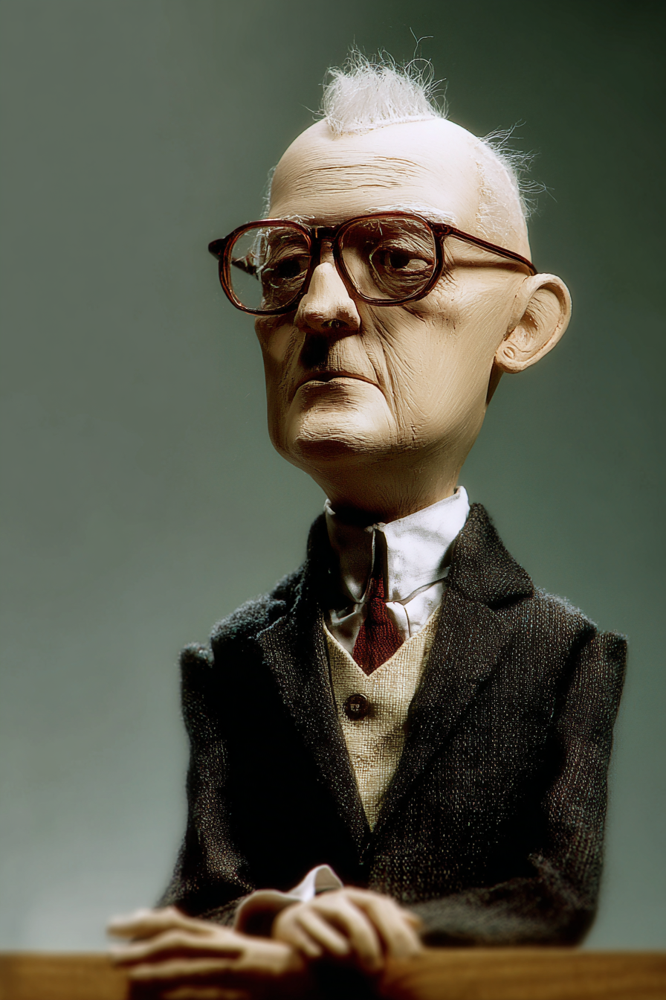
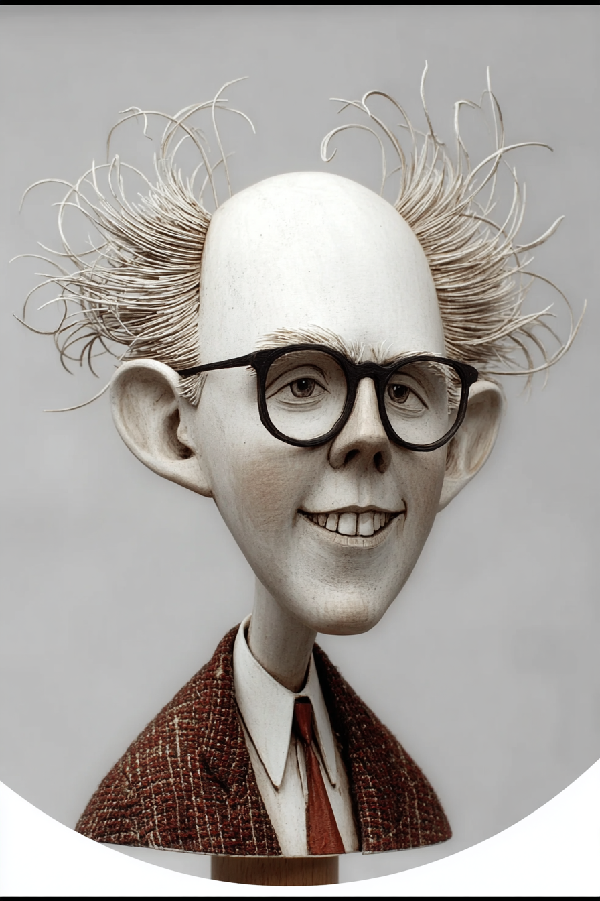

# Design of Agentic Systems with Case Studies — Wayback Sections

> Extracted from `chapters/`. Each entry corresponds to one chapter file.
> Sections are instructor-authored. Missing sections show a placeholder only.
> Do not edit this file directly — edit the source chapter file, then re-run extraction.

---

## Chapter 00: Design of Agentic Systems with Case Studies
*Source: `chapters/00-frontmatter.md`*

> **Section not yet authored.** No `## AI Wayback Machine` block found in this chapter file.
> To add this section, edit the source chapter file directly.

---

## Chapter 00: Introduction
*Source: `chapters/00-introduction.md`*

> **Section not yet authored.** No `## AI Wayback Machine` block found in this chapter file.
> To add this section, edit the source chapter file directly.

---

## Chapter 00: Preface
*Source: `chapters/00-preface.md`*

## AI Wayback Machine

**Margaret Hamilton** was led the Apollo Guidance Computer software team — coining "software engineering" and pioneering reliable autonomous control software.


*Puppet Art by [Nik Bear Brown](https://www.nikbearbrown.com/).*

**Run this:**

```
Who is Margaret Hamilton, and how does their work connect to the agentic system design we covered in this chapter? Keep it to three paragraphs. End with the single most surprising thing about their career or ideas.
```

→ Search **"Margaret Hamilton"** on Wikipedia.

**Now make the prompt better.** Try one of these:

- Ask it to apply Margaret Hamilton's framework to a specific agent design problem you face.
- Add a constraint: "Answer including criticisms or limits of Margaret Hamilton's framework."

What changes? What gets better? What gets worse?

---

## Chapter 01: Chapter 1 — The Move That Changed Everything
*Source: `chapters/01-move-that-changed-everything.md`*

## AI Wayback Machine

**Lee Sedol** was Korean Go champion whose 2016 defeat by AlphaGo and his famous "move 78" reply marked the moment AI became real for working practitioners.

**Run this:**

```
Who is Lee Sedol, and how does their work connect to the pivotal moments in AI we covered in this chapter? Keep it to three paragraphs. End with the single most surprising thing about their career or ideas.
```

→ Search **"Lee Sedol"** on Wikipedia.

**Now make the prompt better.** Try one of these:

- Ask it to apply Lee Sedol's framework to a specific agent design problem you face.
- Add a constraint: "Answer including criticisms or limits of Lee Sedol's framework."

What changes? What gets better? What gets worse?

---

## Chapter 02: Chapter 2 — The Blueprint Before the Build
*Source: `chapters/02-blueprint-before-the-build.md`*

## AI Wayback Machine

**Christopher Alexander** was architect whose A Pattern Language (1977) reshaped software design and provided the conceptual ancestry of every modern system blueprint.

**Run this:**

```
Who is Christopher Alexander, and how does their work connect to the blueprint design we covered in this chapter? Keep it to three paragraphs. End with the single most surprising thing about their career or ideas.
```

→ Search **"Christopher Alexander"** on Wikipedia.

**Now make the prompt better.** Try one of these:

- Ask it to apply Christopher Alexander's framework to a specific agent design problem you face.
- Add a constraint: "Answer including criticisms or limits of Christopher Alexander's framework."

What changes? What gets better? What gets worse?

---

## Chapter 03: Chapter 3 — Five Patterns, Five Trade-offs
*Source: `chapters/03-five-patterns-five-tradeoffs.md`*

## AI Wayback Machine

**Erich Gamma** was co-authored the Gang of Four book Design Patterns (1994) — founding the modern vocabulary of design patterns and tradeoffs.

**Run this:**

```
Who is Erich Gamma, and how does their work connect to the patterns and tradeoffs we covered in this chapter? Keep it to three paragraphs. End with the single most surprising thing about their career or ideas.
```

→ Search **"Erich Gamma"** on Wikipedia.

**Now make the prompt better.** Try one of these:

- Ask it to apply Erich Gamma's framework to a specific agent design problem you face.
- Add a constraint: "Answer including criticisms or limits of Erich Gamma's framework."

What changes? What gets better? What gets worse?

---

## Chapter 04: Chapter 4 — RAG 101
*Source: `chapters/04-rag-101.md`*

## AI Wayback Machine

**Gerard Salton** was founded modern information retrieval at Cornell — including the vector space model that underlies every modern RAG pipeline.

**Run this:**

```
Who is Gerard Salton, and how does their work connect to the retrieval-augmented generation we covered in this chapter? Keep it to three paragraphs. End with the single most surprising thing about their career or ideas.
```

→ Search **"Gerard Salton"** on Wikipedia.

**Now make the prompt better.** Try one of these:

- Ask it to apply Gerard Salton's framework to a specific agent design problem you face.
- Add a constraint: "Answer including criticisms or limits of Gerard Salton's framework."

What changes? What gets better? What gets worse?

---

## Chapter 05: Chapter 5 — Choosing and Configuring Your RAG Pipeline
*Source: `chapters/05-configuring-your-rag-pipeline.md`*

## AI Wayback Machine

**Karen Spärck Jones** was developed inverse document frequency (IDF) in 1972 — the statistical foundation underlying modern retrieval systems.

**Run this:**

```
Who is Karen Spärck Jones, and how does their work connect to the configuring RAG we covered in this chapter? Keep it to three paragraphs. End with the single most surprising thing about their career or ideas.
```

→ Search **"Karen Spärck Jones"** on Wikipedia.

**Now make the prompt better.** Try one of these:

- Ask it to apply Karen Spärck Jones's framework to a specific agent design problem you face.
- Add a constraint: "Answer including criticisms or limits of Karen Spärck Jones's framework."

What changes? What gets better? What gets worse?

---

## Chapter 06: Chapter 6 — Grounding Agents in Evidence
*Source: `chapters/06-grounding-agents-in-evidence.md`*

## AI Wayback Machine

**Hilary Putnam** was philosopher whose "Brain in a Vat" argument forced careful thinking about how meaning gets grounded in the external world.

**Run this:**

```
Who is Hilary Putnam, and how does their work connect to the grounding agents in evidence we covered in this chapter? Keep it to three paragraphs. End with the single most surprising thing about their career or ideas.
```

→ Search **"Hilary Putnam"** on Wikipedia.

**Now make the prompt better.** Try one of these:

- Ask it to apply Hilary Putnam's framework to a specific agent design problem you face.
- Add a constraint: "Answer including criticisms or limits of Hilary Putnam's framework."

What changes? What gets better? What gets worse?

---

## Chapter 07: Chapter 7 — Hallucination: When Plausibility Beats Truth
*Source: `chapters/07-hallucination-plausibility-vs-truth.md`*

## AI Wayback Machine

**Daniel Kahneman** was psychologist whose Thinking, Fast and Slow framework explains why fluent output gets trusted over careful reasoning.

**Run this:**

```
Who is Daniel Kahneman, and how does their work connect to the plausibility vs truth in agents we covered in this chapter? Keep it to three paragraphs. End with the single most surprising thing about their career or ideas.
```

→ Search **"Daniel Kahneman"** on Wikipedia.

**Now make the prompt better.** Try one of these:

- Ask it to apply Daniel Kahneman's framework to a specific agent design problem you face.
- Add a constraint: "Answer including criticisms or limits of Daniel Kahneman's framework."

What changes? What gets better? What gets worse?

---

## Chapter 08: Chapter 8 — The Attack Surface No One Designed For
*Source: `chapters/08-attack-surface-no-one-designed-for.md`*

## AI Wayback Machine

**Bruce Schneier** was security technologist who has been writing about systems attack surfaces since the 1990s.

**Run this:**

```
Who is Bruce Schneier, and how does their work connect to the agent attack surfaces we covered in this chapter? Keep it to three paragraphs. End with the single most surprising thing about their career or ideas.
```

→ Search **"Bruce Schneier"** on Wikipedia.

**Now make the prompt better.** Try one of these:

- Ask it to apply Bruce Schneier's framework to a specific agent design problem you face.
- Add a constraint: "Answer including criticisms or limits of Bruce Schneier's framework."

What changes? What gets better? What gets worse?

---

## Chapter 09: Chapter 9 — Five Ways Context Kills Agents
*Source: `chapters/09-five-ways-context-kills-agents.md`*

## AI Wayback Machine

**Lucy Suchman** was anthropologist whose Plans and Situated Actions (1987) showed why context matters so much for intelligent action.

**Run this:**

```
Who is Lucy Suchman, and how does their work connect to the context and agents we covered in this chapter? Keep it to three paragraphs. End with the single most surprising thing about their career or ideas.
```

→ Search **"Lucy Suchman"** on Wikipedia.

**Now make the prompt better.** Try one of these:

- Ask it to apply Lucy Suchman's framework to a specific agent design problem you face.
- Add a constraint: "Answer including criticisms or limits of Lucy Suchman's framework."

What changes? What gets better? What gets worse?

---

## Chapter 10: Chapter 10 — When Coordinated Agents Become Unpredictable
*Source: `chapters/10-coordinated-agents-emergence.md`*

## AI Wayback Machine

**John Holland** was founded complex adaptive systems and agent-based modeling at Michigan — the theoretical framework for emergent multi-agent coordination.

**Run this:**

```
Who is John Holland, and how does their work connect to the coordinated multi-agent systems we covered in this chapter? Keep it to three paragraphs. End with the single most surprising thing about their career or ideas.
```

→ Search **"John Holland"** on Wikipedia.

**Now make the prompt better.** Try one of these:

- Ask it to apply John Holland's framework to a specific agent design problem you face.
- Add a constraint: "Answer including criticisms or limits of John Holland's framework."

What changes? What gets better? What gets worse?

---

## Chapter 11: Chapter 11 — Model Economics and the Build-or-Buy Decision
*Source: `chapters/11-model-economics.md`*

## AI Wayback Machine

**William Nordhaus** was Nobel-winning economist whose work on the economics of computation and energy frames how to think about per-token costs.


*Puppet Art by [Nik Bear Brown](https://www.nikbearbrown.com/).*

**Run this:**

```
Who is William Nordhaus, and how does their work connect to the model economics we covered in this chapter? Keep it to three paragraphs. End with the single most surprising thing about their career or ideas.
```

→ Search **"William Nordhaus"** on Wikipedia.

**Now make the prompt better.** Try one of these:

- Ask it to apply William Nordhaus's framework to a specific agent design problem you face.
- Add a constraint: "Answer including criticisms or limits of William Nordhaus's framework."

What changes? What gets better? What gets worse?

---

## Chapter 12: Chapter 12 — Choosing Your Weapon
*Source: `chapters/12-choosing-your-weapon.md`*

## AI Wayback Machine

**Frederick Brooks** was wrote The Mythical Man-Month (1975) — the founding meditation on choosing the right tool for the right software job.


*Puppet Art by [Nik Bear Brown](https://www.nikbearbrown.com/).*

**Run this:**

```
Who is Frederick Brooks, and how does their work connect to the choosing tools we covered in this chapter? Keep it to three paragraphs. End with the single most surprising thing about their career or ideas.
```

→ Search **"Frederick Brooks"** on Wikipedia.

**Now make the prompt better.** Try one of these:

- Ask it to apply Frederick Brooks's framework to a specific agent design problem you face.
- Add a constraint: "Answer including criticisms or limits of Frederick Brooks's framework."

What changes? What gets better? What gets worse?

---

## Chapter 13: Chapter 13 — The Protocol Layer: MCP, ACP, and the Interoperability Standard
*Source: `chapters/13-protocol-layer.md`*

## AI Wayback Machine

**Vint Cerf** was co-designed TCP/IP — the protocol layer that defines the modern internet and the conceptual ancestor of agent protocol design.


*Puppet Art by [Nik Bear Brown](https://www.nikbearbrown.com/).*

**Run this:**

```
Who is Vint Cerf, and how does their work connect to the protocols we covered in this chapter? Keep it to three paragraphs. End with the single most surprising thing about their career or ideas.
```

→ Search **"Vint Cerf"** on Wikipedia.

**Now make the prompt better.** Try one of these:

- Ask it to apply Vint Cerf's framework to a specific agent design problem you face.
- Add a constraint: "Answer including criticisms or limits of Vint Cerf's framework."

What changes? What gets better? What gets worse?

---

## Chapter 14: Chapter 14 — Twelve Production Builds: A Scaffolded Project Sequence
*Source: `chapters/14-twelve-production-builds.md`*

## AI Wayback Machine

**Grace Hopper** was wrote the first compiler (A-0) in 1952 — and pioneered the discipline of moving software from research prototype to production.


*Puppet Art by [Nik Bear Brown](https://www.nikbearbrown.com/).*

**Run this:**

```
Who is Grace Hopper, and how does their work connect to the production builds we covered in this chapter? Keep it to three paragraphs. End with the single most surprising thing about their career or ideas.
```

→ Search **"Grace Hopper"** on Wikipedia.

**Now make the prompt better.** Try one of these:

- Ask it to apply Grace Hopper's framework to a specific agent design problem you face.
- Add a constraint: "Answer including criticisms or limits of Grace Hopper's framework."

What changes? What gets better? What gets worse?

---

## Chapter 15: Chapter 15 — Case: CodeSentinel
*Source: `chapters/15-case-codesentinel.md`*

## AI Wayback Machine

**Barbara Liskov** was pioneered data abstraction and type-safe software design — the Liskov substitution principle anchors modern static analysis.


*Puppet Art by [Nik Bear Brown](https://www.nikbearbrown.com/).*

**Run this:**

```
Who is Barbara Liskov, and how does their work connect to the code analysis agents we covered in this chapter? Keep it to three paragraphs. End with the single most surprising thing about their career or ideas.
```

→ Search **"Barbara Liskov"** on Wikipedia.

**Now make the prompt better.** Try one of these:

- Ask it to apply Barbara Liskov's framework to a specific agent design problem you face.
- Add a constraint: "Answer including criticisms or limits of Barbara Liskov's framework."

What changes? What gets better? What gets worse?

---

## Chapter 16: Chapter 16 — Case: VerifAI
*Source: `chapters/16-case-verifai.md`*

## AI Wayback Machine

**Tony Hoare** was developed quicksort, communicating sequential processes, and formal verification methods that prefigure AI verification.

**Run this:**

```
Who is Tony Hoare, and how does their work connect to the AI verification we covered in this chapter? Keep it to three paragraphs. End with the single most surprising thing about their career or ideas.
```

→ Search **"Tony Hoare"** on Wikipedia.

**Now make the prompt better.** Try one of these:

- Ask it to apply Tony Hoare's framework to a specific agent design problem you face.
- Add a constraint: "Answer including criticisms or limits of Tony Hoare's framework."

What changes? What gets better? What gets worse?

---

## Chapter 17: Chapter 17 — Case: PharmGuard AI
*Source: `chapters/17-case-pharmguard.md`*

## AI Wayback Machine

**Frances Oldham Kelsey** was FDA reviewer who refused to approve thalidomide in 1960 — establishing the discipline of skeptical pharmaceutical safety review.


*Puppet Art by [Nik Bear Brown](https://www.nikbearbrown.com/).*

**Run this:**

```
Who is Frances Oldham Kelsey, and how does their work connect to the pharmaceutical safety review agents we covered in this chapter? Keep it to three paragraphs. End with the single most surprising thing about their career or ideas.
```

→ Search **"Frances Oldham Kelsey"** on Wikipedia.

**Now make the prompt better.** Try one of these:

- Ask it to apply Frances Oldham Kelsey's framework to a specific agent design problem you face.
- Add a constraint: "Answer including criticisms or limits of Frances Oldham Kelsey's framework."

What changes? What gets better? What gets worse?

---

## Chapter 18: Chapter 18 — Case: BioClaim Guard
*Source: `chapters/18-case-bioclaim-guard.md`*

## AI Wayback Machine

**John Ioannidis** was epidemiologist whose 2005 paper "Why Most Published Research Findings Are False" defined the modern problem of evaluating biomedical claims.

**Run this:**

```
Who is John Ioannidis, and how does their work connect to the biomedical claim verification we covered in this chapter? Keep it to three paragraphs. End with the single most surprising thing about their career or ideas.
```

→ Search **"John Ioannidis"** on Wikipedia.

**Now make the prompt better.** Try one of these:

- Ask it to apply John Ioannidis's framework to a specific agent design problem you face.
- Add a constraint: "Answer including criticisms or limits of John Ioannidis's framework."

What changes? What gets better? What gets worse?

---

## Chapter 19: Chapter 19 — Case: ClearDischarge
*Source: `chapters/19-case-cleardischarge.md`*

## AI Wayback Machine

**Atul Gawande** was surgeon whose Checklist Manifesto reshaped how hospitals handle high-stakes handoffs like discharges.

**Run this:**

```
Who is Atul Gawande, and how does their work connect to the hospital discharge agents we covered in this chapter? Keep it to three paragraphs. End with the single most surprising thing about their career or ideas.
```

→ Search **"Atul Gawande"** on Wikipedia.

**Now make the prompt better.** Try one of these:

- Ask it to apply Atul Gawande's framework to a specific agent design problem you face.
- Add a constraint: "Answer including criticisms or limits of Atul Gawande's framework."

What changes? What gets better? What gets worse?

---

## Chapter 20: Chapter 20 — Case: AIRA
*Source: `chapters/20-case-aira.md`*

## AI Wayback Machine

**Joseph Weizenbaum** was built ELIZA in 1966 and spent the rest of his career warning that people would form real emotional attachments to conversational AI.

**Run this:**

```
Who is Joseph Weizenbaum, and how does their work connect to the AI assistants we covered in this chapter? Keep it to three paragraphs. End with the single most surprising thing about their career or ideas.
```

→ Search **"Joseph Weizenbaum"** on Wikipedia.

**Now make the prompt better.** Try one of these:

- Ask it to apply Joseph Weizenbaum's framework to a specific agent design problem you face.
- Add a constraint: "Answer including criticisms or limits of Joseph Weizenbaum's framework."

What changes? What gets better? What gets worse?

---

## Chapter 21: Chapter 21 — Case: CrisisLens
*Source: `chapters/21-case-crisislens.md`*

## AI Wayback Machine

**Charles Perrow** was sociologist whose Normal Accidents (1984) framework explains how complex, tightly-coupled systems fail in crisis.

**Run this:**

```
Who is Charles Perrow, and how does their work connect to the crisis-response agents we covered in this chapter? Keep it to three paragraphs. End with the single most surprising thing about their career or ideas.
```

→ Search **"Charles Perrow"** on Wikipedia.

**Now make the prompt better.** Try one of these:

- Ask it to apply Charles Perrow's framework to a specific agent design problem you face.
- Add a constraint: "Answer including criticisms or limits of Charles Perrow's framework."

What changes? What gets better? What gets worse?

---

## Chapter 22: Chapter 22 — Case: TrialMatch AI
*Source: `chapters/22-case-trialmatch.md`*

## AI Wayback Machine

**Janet Wittes** was biostatistician who built much of modern clinical-trial design infrastructure — including data safety monitoring boards.

**Run this:**

```
Who is Janet Wittes, and how does their work connect to the clinical trial matching we covered in this chapter? Keep it to three paragraphs. End with the single most surprising thing about their career or ideas.
```

→ Search **"Janet Wittes"** on Wikipedia.

**Now make the prompt better.** Try one of these:

- Ask it to apply Janet Wittes's framework to a specific agent design problem you face.
- Add a constraint: "Answer including criticisms or limits of Janet Wittes's framework."

What changes? What gets better? What gets worse?

---

## Chapter 23: Chapter 23 — Case: PolicyLens
*Source: `chapters/23-case-policylens.md`*

## AI Wayback Machine

**Cass Sunstein** was legal scholar who built the modern framework for cost-benefit analysis in regulatory policy.

**Run this:**

```
Who is Cass Sunstein, and how does their work connect to the policy analysis agents we covered in this chapter? Keep it to three paragraphs. End with the single most surprising thing about their career or ideas.
```

→ Search **"Cass Sunstein"** on Wikipedia.

**Now make the prompt better.** Try one of these:

- Ask it to apply Cass Sunstein's framework to a specific agent design problem you face.
- Add a constraint: "Answer including criticisms or limits of Cass Sunstein's framework."

What changes? What gets better? What gets worse?

---

## Chapter 24: Chapter 24 — Case: PlanLens
*Source: `chapters/24-case-planlens.md`*

## AI Wayback Machine

**Herbert Simon** was Nobel-winning economist and AI pioneer who built the theory of bounded rationality in planning under uncertainty.

**Run this:**

```
Who is Herbert Simon, and how does their work connect to the planning agents we covered in this chapter? Keep it to three paragraphs. End with the single most surprising thing about their career or ideas.
```

→ Search **"Herbert Simon"** on Wikipedia.

**Now make the prompt better.** Try one of these:

- Ask it to apply Herbert Simon's framework to a specific agent design problem you face.
- Add a constraint: "Answer including criticisms or limits of Herbert Simon's framework."

What changes? What gets better? What gets worse?

---

## Chapter 25: Chapter 25 — Case: TacticalLens
*Source: `chapters/25-case-tacticallens.md`*

## AI Wayback Machine

**John Boyd** was fighter pilot turned strategist whose OODA loop (Observe, Orient, Decide, Act) framework now guides tactical and operational reasoning.

**Run this:**

```
Who is John Boyd, and how does their work connect to the tactical decision agents we covered in this chapter? Keep it to three paragraphs. End with the single most surprising thing about their career or ideas.
```

→ Search **"John Boyd"** on Wikipedia.

**Now make the prompt better.** Try one of these:

- Ask it to apply John Boyd's framework to a specific agent design problem you face.
- Add a constraint: "Answer including criticisms or limits of John Boyd's framework."

What changes? What gets better? What gets worse?

---

## Chapter 26: Chapter 26 — Case: Pitch Verdict
*Source: `chapters/26-case-pitch-verdict.md`*

## AI Wayback Machine

**Daniel Kahneman** was work on the planning fallacy and base rates is the modern foundation for evaluating ambitious pitches and forecasts.

**Run this:**

```
Who is Daniel Kahneman, and how does their work connect to the pitch evaluation we covered in this chapter? Keep it to three paragraphs. End with the single most surprising thing about their career or ideas.
```

→ Search **"Daniel Kahneman"** on Wikipedia.

**Now make the prompt better.** Try one of these:

- Ask it to apply Daniel Kahneman's framework to a specific agent design problem you face.
- Add a constraint: "Answer including criticisms or limits of Daniel Kahneman's framework."

What changes? What gets better? What gets worse?

---

## Chapter 27: Chapter 27 — Case: Pygmy
*Source: `chapters/27-case-pygmy.md`*

## AI Wayback Machine

**Mary Allen Wilkes** was programmed the LINC at MIT in 1965 and operated it from her parents' living room — the first programmer of what we would call a personal computer.


*Puppet Art by [Nik Bear Brown](https://www.nikbearbrown.com/).*

**Run this:**

```
Who is Mary Allen Wilkes, and how does their work connect to the small footprint agents we covered in this chapter? Keep it to three paragraphs. End with the single most surprising thing about their career or ideas.
```

→ Search **"Mary Allen Wilkes"** on Wikipedia.

**Now make the prompt better.** Try one of these:

- Ask it to apply Mary Allen Wilkes's framework to a specific agent design problem you face.
- Add a constraint: "Answer including criticisms or limits of Mary Allen Wilkes's framework."

What changes? What gets better? What gets worse?

---

## Chapter 28: Chapter 28 — Case: Jobzilla AI
*Source: `chapters/28-case-jobzilla.md`*

## AI Wayback Machine

**Claudia Goldin** was Nobel-winning labor economist whose work on the gender gap and career structure reframed labor-market analysis.

**Run this:**

```
Who is Claudia Goldin, and how does their work connect to the job-market agents we covered in this chapter? Keep it to three paragraphs. End with the single most surprising thing about their career or ideas.
```

→ Search **"Claudia Goldin"** on Wikipedia.

**Now make the prompt better.** Try one of these:

- Ask it to apply Claudia Goldin's framework to a specific agent design problem you face.
- Add a constraint: "Answer including criticisms or limits of Claudia Goldin's framework."

What changes? What gets better? What gets worse?

---

## Chapter 29: Chapter 29 — Case: CostSherlock
*Source: `chapters/29-case-costsherlock.md`*

## AI Wayback Machine

**Eli Goldratt** was physicist-turned-management-theorist who built the Theory of Constraints — a framework for diagnosing cost and throughput bottlenecks.

**Run this:**

```
Who is Eli Goldratt, and how does their work connect to the cost analysis agents we covered in this chapter? Keep it to three paragraphs. End with the single most surprising thing about their career or ideas.
```

→ Search **"Eli Goldratt"** on Wikipedia.

**Now make the prompt better.** Try one of these:

- Ask it to apply Eli Goldratt's framework to a specific agent design problem you face.
- Add a constraint: "Answer including criticisms or limits of Eli Goldratt's framework."

What changes? What gets better? What gets worse?

---

## Chapter 30: Chapter 30 — Case: LitmusQE
*Source: `chapters/30-case-litmusqe.md`*

## AI Wayback Machine

**W. Edwards Deming** was statistician who built the modern theory of quality engineering — the framework underlies every serious QA system in software and manufacturing.



*Puppet Art by [Nik Bear Brown](https://www.nikbearbrown.com/).*

**Run this:**

```
Who is W. Edwards Deming, and how does their work connect to the quality engineering agents we covered in this chapter? Keep it to three paragraphs. End with the single most surprising thing about their career or ideas.
```

→ Search **"W. Edwards Deming"** on Wikipedia.

**Now make the prompt better.** Try one of these:

- Ask it to apply W. Edwards Deming's framework to a specific agent design problem you face.
- Add a constraint: "Answer including criticisms or limits of W. Edwards Deming's framework."

What changes? What gets better? What gets worse?

---

## Chapter 31: Chapter 31 — Case: SchemaGuard
*Source: `chapters/31-case-schemaguard.md`*

## AI Wayback Machine

**Edgar F. Codd** was invented the relational data model in 1970 — defining the constraints and normalization rules that modern schema validation still uses.


*Puppet Art by [Nik Bear Brown](https://www.nikbearbrown.com/).*

**Run this:**

```
Who is Edgar F. Codd, and how does their work connect to the schema validation agents we covered in this chapter? Keep it to three paragraphs. End with the single most surprising thing about their career or ideas.
```

→ Search **"Edgar F. Codd"** on Wikipedia.

**Now make the prompt better.** Try one of these:

- Ask it to apply Edgar F. Codd's framework to a specific agent design problem you face.
- Add a constraint: "Answer including criticisms or limits of Edgar F. Codd's framework."

What changes? What gets better? What gets worse?

---

## Chapter 32: Chapter 32 — Case: CLIS V2
*Source: `chapters/32-case-clis-v2.md`*

## AI Wayback Machine

**Brian Kernighan** was co-authored The C Programming Language and built much of the original Unix toolchain — defining what makes a good CLI.

**Run this:**

```
Who is Brian Kernighan, and how does their work connect to the CLI design we covered in this chapter? Keep it to three paragraphs. End with the single most surprising thing about their career or ideas.
```

→ Search **"Brian Kernighan"** on Wikipedia.

**Now make the prompt better.** Try one of these:

- Ask it to apply Brian Kernighan's framework to a specific agent design problem you face.
- Add a constraint: "Answer including criticisms or limits of Brian Kernighan's framework."

What changes? What gets better? What gets worse?

---

## Chapter 33: Chapter 33 — Case: CloudArch Designer
*Source: `chapters/33-case-cloudarch.md`*

## AI Wayback Machine

**Werner Vogels** was Amazon CTO whose work on distributed systems consistency models defines the modern cloud architecture rulebook.

**Run this:**

```
Who is Werner Vogels, and how does their work connect to the cloud architecture agents we covered in this chapter? Keep it to three paragraphs. End with the single most surprising thing about their career or ideas.
```

→ Search **"Werner Vogels"** on Wikipedia.

**Now make the prompt better.** Try one of these:

- Ask it to apply Werner Vogels's framework to a specific agent design problem you face.
- Add a constraint: "Answer including criticisms or limits of Werner Vogels's framework."

What changes? What gets better? What gets worse?

---

## Chapter 34: Chapter 34 — Case: Personal Cybersecurity Guardian
*Source: `chapters/34-case-cybersecurity-guardian.md`*

## AI Wayback Machine

**Dorothy Denning** was cryptographer whose 1986 paper on intrusion detection systems is the foundational document for cybersecurity monitoring.

**Run this:**

```
Who is Dorothy Denning, and how does their work connect to the cybersecurity agents we covered in this chapter? Keep it to three paragraphs. End with the single most surprising thing about their career or ideas.
```

→ Search **"Dorothy Denning"** on Wikipedia.

**Now make the prompt better.** Try one of these:

- Ask it to apply Dorothy Denning's framework to a specific agent design problem you face.
- Add a constraint: "Answer including criticisms or limits of Dorothy Denning's framework."

What changes? What gets better? What gets worse?

---

## Chapter 35: Chapter 35 — Case: Syllabus Navigator
*Source: `chapters/35-case-syllabus-navigator.md`*

## AI Wayback Machine

**Benjamin Bloom** was educational psychologist whose taxonomy of learning objectives (1956) still structures how syllabi sequence knowledge and skills.

**Run this:**

```
Who is Benjamin Bloom, and how does their work connect to the syllabus design agents we covered in this chapter? Keep it to three paragraphs. End with the single most surprising thing about their career or ideas.
```

→ Search **"Benjamin Bloom"** on Wikipedia.

**Now make the prompt better.** Try one of these:

- Ask it to apply Benjamin Bloom's framework to a specific agent design problem you face.
- Add a constraint: "Answer including criticisms or limits of Benjamin Bloom's framework."

What changes? What gets better? What gets worse?

---

## Chapter 36: Chapter 36 — Case: Adaptive Linear Algebra Explainer (Faraz)
*Source: `chapters/36-case-adaptive-linalg-faraz.md`*

## AI Wayback Machine

**James Wilkinson** was numerical analyst who built much of the foundation of modern adaptive linear algebra — error analysis, backward stability, iterative solvers.


*Puppet Art by [Nik Bear Brown](https://www.nikbearbrown.com/).*

**Run this:**

```
Who is James Wilkinson, and how does their work connect to the adaptive linear algebra we covered in this chapter? Keep it to three paragraphs. End with the single most surprising thing about their career or ideas.
```

→ Search **"James Wilkinson"** on Wikipedia.

**Now make the prompt better.** Try one of these:

- Ask it to apply James Wilkinson's framework to a specific agent design problem you face.
- Add a constraint: "Answer including criticisms or limits of James Wilkinson's framework."

What changes? What gets better? What gets worse?

---

## Chapter 37: Chapter 37 — Case: Adaptive Linear Algebra Explainer (Abdul)
*Source: `chapters/37-case-adaptive-linalg-abdul.md`*

## AI Wayback Machine

**Cleve Moler** was creator of MATLAB and co-founder of MathWorks — built the libraries underlying most modern adaptive numerical linear algebra.

**Run this:**

```
Who is Cleve Moler, and how does their work connect to the adaptive linear algebra we covered in this chapter? Keep it to three paragraphs. End with the single most surprising thing about their career or ideas.
```

→ Search **"Cleve Moler"** on Wikipedia.

**Now make the prompt better.** Try one of these:

- Ask it to apply Cleve Moler's framework to a specific agent design problem you face.
- Add a constraint: "Answer including criticisms or limits of Cleve Moler's framework."

What changes? What gets better? What gets worse?

---

## Chapter 38: Chapter 38 — Case: AI-Powered Stock Research Platform
*Source: `chapters/38-case-stock-research.md`*

## AI Wayback Machine

**Benjamin Graham** was wrote Security Analysis in 1934 — the founding methodology of careful financial due diligence.


*Puppet Art by [Nik Bear Brown](https://www.nikbearbrown.com/).*

**Run this:**

```
Who is Benjamin Graham, and how does their work connect to the stock research agents we covered in this chapter? Keep it to three paragraphs. End with the single most surprising thing about their career or ideas.
```

→ Search **"Benjamin Graham"** on Wikipedia.

**Now make the prompt better.** Try one of these:

- Ask it to apply Benjamin Graham's framework to a specific agent design problem you face.
- Add a constraint: "Answer including criticisms or limits of Benjamin Graham's framework."

What changes? What gets better? What gets worse?

---

## Chapter 39: Chapter 39 — Case: Immigrant Tax Filing Assistant
*Source: `chapters/39-case-immigrant-tax.md`*

## AI Wayback Machine

**Stephen Shay** was tax-law scholar whose work on international taxation defines the modern framework for analyzing cross-border tax obligations.

**Run this:**

```
Who is Stephen Shay, and how does their work connect to the immigrant tax agents we covered in this chapter? Keep it to three paragraphs. End with the single most surprising thing about their career or ideas.
```

→ Search **"Stephen Shay"** on Wikipedia.

**Now make the prompt better.** Try one of these:

- Ask it to apply Stephen Shay's framework to a specific agent design problem you face.
- Add a constraint: "Answer including criticisms or limits of Stephen Shay's framework."

What changes? What gets better? What gets worse?

---

## Chapter 40: Chapter 40 — Case: MindMirror
*Source: `chapters/40-case-mindmirror.md`*

## AI Wayback Machine

**Aaron Beck** was psychiatrist who founded cognitive therapy in the 1960s — the structured questioning approach that mental-health agents build upon.

**Run this:**

```
Who is Aaron Beck, and how does their work connect to the mental-health agents we covered in this chapter? Keep it to three paragraphs. End with the single most surprising thing about their career or ideas.
```

→ Search **"Aaron Beck"** on Wikipedia.

**Now make the prompt better.** Try one of these:

- Ask it to apply Aaron Beck's framework to a specific agent design problem you face.
- Add a constraint: "Answer including criticisms or limits of Aaron Beck's framework."

What changes? What gets better? What gets worse?

---

## Chapter 41: Chapter 41 — Case: Research Claim Auditor
*Source: `chapters/41-case-research-claim-auditor.md`*

## AI Wayback Machine

**Donald Rubin** was developed the potential outcomes framework — the foundation for evaluating causal claims in research.

**Run this:**

```
Who is Donald Rubin, and how does their work connect to the research claim auditing we covered in this chapter? Keep it to three paragraphs. End with the single most surprising thing about their career or ideas.
```

→ Search **"Donald Rubin"** on Wikipedia.

**Now make the prompt better.** Try one of these:

- Ask it to apply Donald Rubin's framework to a specific agent design problem you face.
- Add a constraint: "Answer including criticisms or limits of Donald Rubin's framework."

What changes? What gets better? What gets worse?

---

## Chapter 42: Chapter 42 — Case: WCAG Compliance Auditor
*Source: `chapters/42-case-wcag-auditor.md`*

## AI Wayback Machine

**Vint Cerf** was helped make accessibility a first-class concern in internet protocol design — he wore hearing aids and is partially deaf.


*Puppet Art by [Nik Bear Brown](https://www.nikbearbrown.com/).*

**Run this:**

```
Who is Vint Cerf, and how does their work connect to the accessibility audit agents we covered in this chapter? Keep it to three paragraphs. End with the single most surprising thing about their career or ideas.
```

→ Search **"Vint Cerf"** on Wikipedia.

**Now make the prompt better.** Try one of these:

- Ask it to apply Vint Cerf's framework to a specific agent design problem you face.
- Add a constraint: "Answer including criticisms or limits of Vint Cerf's framework."

What changes? What gets better? What gets worse?

---

## Chapter 43: Chapter 43 — Case: Thought2Do
*Source: `chapters/43-case-thought2do.md`*

## AI Wayback Machine

**David Allen** was wrote Getting Things Done in 2001 — the system of capturing thoughts into action items that productivity tools still implement.



*Puppet Art by [Nik Bear Brown](https://www.nikbearbrown.com/).*

**Run this:**

```
Who is David Allen, and how does their work connect to the thought-to-action agents we covered in this chapter? Keep it to three paragraphs. End with the single most surprising thing about their career or ideas.
```

→ Search **"David Allen"** on Wikipedia.

**Now make the prompt better.** Try one of these:

- Ask it to apply David Allen's framework to a specific agent design problem you face.
- Add a constraint: "Answer including criticisms or limits of David Allen's framework."

What changes? What gets better? What gets worse?

---

## Chapter 44: Chapter 44 — Case: AI Financial Fragility Detector
*Source: `chapters/44-case-financial-fragility.md`*

## AI Wayback Machine

**Hyman Minsky** was economist whose Financial Instability Hypothesis explains how stable financial situations turn unstable.

**Run this:**

```
Who is Hyman Minsky, and how does their work connect to the financial fragility analysis we covered in this chapter? Keep it to three paragraphs. End with the single most surprising thing about their career or ideas.
```

→ Search **"Hyman Minsky"** on Wikipedia.

**Now make the prompt better.** Try one of these:

- Ask it to apply Hyman Minsky's framework to a specific agent design problem you face.
- Add a constraint: "Answer including criticisms or limits of Hyman Minsky's framework."

What changes? What gets better? What gets worse?

---

## Chapter 45: Chapter 45 — Case: StudyMate AI
*Source: `chapters/45-case-studymate.md`*

## AI Wayback Machine

**Marie Montessori** was physician and educator whose method shaped the design of self-directed learning environments — the conceptual ancestor of modern study assistants.


*Puppet Art by [Nik Bear Brown](https://www.nikbearbrown.com/).*

**Run this:**

```
Who is Marie Montessori, and how does their work connect to the study support agents we covered in this chapter? Keep it to three paragraphs. End with the single most surprising thing about their career or ideas.
```

→ Search **"Marie Montessori"** on Wikipedia.

**Now make the prompt better.** Try one of these:

- Ask it to apply Marie Montessori's framework to a specific agent design problem you face.
- Add a constraint: "Answer including criticisms or limits of Marie Montessori's framework."

What changes? What gets better? What gets worse?

---

## Chapter 99: 99 Back Matter
*Source: `chapters/99-back-matter.md`*

> **Section not yet authored.** No `## AI Wayback Machine` block found in this chapter file.
> To add this section, edit the source chapter file directly.

---

## Chapter 50: book-v1 — Design of Agentic Systems with Case Studies
*Source: `chapters/README.md`*

> **Section not yet authored.** No `## AI Wayback Machine` block found in this chapter file.
> To add this section, edit the source chapter file directly.

---
